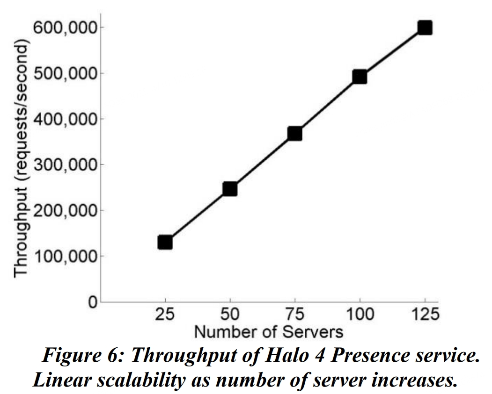

# [Orleans: Distributed Virtual Actors for Programmability and Scalability](https://aka.ms/orleans-paper-2014)

Philip A. Bernstein, Sergey Bykov, Alan Geller, Gabriel Kliot, Jorgen Thelin<br>*Microsoft Research*


## Abstract 

High-scale interactive services demand high throughput  with low latency and high availability, difficult goals to  meet with the traditional stateless 3-tier architecture. The  actor model  makes it natural  to build a  stateful  middle  tier and achieve the required performance. However, the  popular actor model platforms still pass many distributed  systems problems to the developers. 

The Orleans programming model introduces the novel abstraction of virtual actors that solves a number  of  the  complex  distributed  systems  problems,  such  as  reliability and distributed resource management, liberat- ing the developers from dealing with those concerns. At  the same time, the Orleans runtime enables applications  to attain high performance, reliability and scalability. 

This  paper  presents  the  design  principles  behind  Orleans  and  demonstrates  how  Orleans  achieves  a  simple programming model that meets these goals. We  describe  how  Orleans  simplified  the  development  of  several  scalable  production  applications  on  Windows  Azure,  and  report  on  those  production systems. 

## 1. Introduction 

Building  interactive  services  that  are  scalable  and  reliable  is  hard.  Interactivity  imposes  strict  constraints  on availability and latency, as that directly impacts end- used  experience.  To  support  a  large  number  of  concurrent user sessions, high throughput is essential. 

The  traditional  three-tier  architecture  with  stateless  front-ends, stateless middle tier and a storage layer  has  limited scalability due to latency and throughput limits  of  the  storage  layer  that  has  to  be  consulted  for  every  request. A caching  layer  is  often  added  between  the  middle tier and storage to improve performance [^9][^14][^19].  However,  a  cache  loses  most  of  the  concurrency  and semantic guarantees of the underlying storage layer.  To prevent inconsistencies caused by concurrent updates  to a cached item, the application or cache manager has to  implement a concurrency control protocol [^11]. With or  without  cache,  a  stateless  middle  tier  does  not  provide  data  locality  since  it  uses  the  data  shipping paradigm:  for every request, data is sent from storage or cache to  the middle tier server that is processing the request. The  advent of social graphs where a single request may touch  many  entities  connected  dynamically  with  multi-hop  relationships makes it even more challenging to satisfy required application-level semantics and consistency on  a cache with fast response for interactive access. 

The actor model offers an appealing solution to these  challenges by relying on the function shipping paradigm.  Actors allow building a stateful middle tier that has the  performance  benefits  of  a  cache  with  data  locality  and  the  semantic  and  consistency  benefits  of  encapsulated  entities via application-specific  operations. In addition,  actors  make  it  easy  to  implement  horizontal,  “social”,  relations between entities in the middle tier.  

Another view of distributed systems programmabil- ity  is  through  the  lens  of  the  object-oriented  program- ming (OOP) paradigm. While OOP is an intuitive way to  model complex systems, it has been marginalized by the  popular  service-oriented  architecture  (SOA).  One  can  still  benefit  from  OOP  when  implementing  service  components.  However,  at  the  system  level,  developers  have  to  think  in  terms  of  loosely-coupled  partitioned  services,  which  often  do  not  match  the  application’s  conceptual objects. This has contributed to the difficulty  systems  by  mainstream  of  building  distributed  developers.  The  actor  model  brings  OOP  back  to  the  system  level  with  actors  appearing  to  developers  very  much like the familiar model of interacting objects. 

Actor platforms such as Erlang [^3] and Akka [^2] are  a  step  forward  in  simplifying  distributed  system  pro- gramming.  However, they still  burden  developers  with  many  distributed  system  complexities  because  of  the  relatively low level of provided abstractions and system  services. The key challenges are the need to manage the  lifecycle of actors in the application code and deal with  inherent  distributed  races,  the  responsibility  to  handle  failures and recovery of actors, the placement of actors,  and  thus  distributed  resource  management.  To  build  a  correct solution to such problems in the application, the  developer must be a distributed systems expert. 

To  avoid  these  complexities,  we  built  the  Orleans  programming model and runtime, which raises the level  of the actor abstraction. Orleans targets developers who  are  not  distributed  system  experts,  although  our  expert  customers have found it attractive too. It is actor-based,  but  differs  from  existing  actor-based  platforms  by  treating  actors  as  virtual  entities,  not  as  physical  ones.  First, an Orleans actor always exists, virtually. It cannot  be  explicitly  created  or  destroyed.  Its  existence  transcends  the  lifetime  of  any  of  its  in-memory  instantiations,  and  thus  transcends  the  lifetime  of  any  particular  are  server.  Second,  Orleans  automatically  instantiated:  if  there  is  no  in-memory actors instance of an actor, a message sent to the actor causes a  new  instance  to  be  created  on  an  available  server.  An  unused actor instance is automatically reclaimed as part  of runtime resource management. An actor never fails: if  a server S crashes, the next message sent to an actor  A  that was running on S causes Orleans to automatically re- instantiate A on another server, eliminating the need for  applications  to  supervise  and  explicitly  re-create  failed  actors.  Third,  the  location  of  the  actor  instance  is  transparent  to  the  application  code,  which  greatly  simplifies  programming.  And  fourth,  Orleans  can  automatically  create  multiple  instances  of  the  same  stateless actor, seamlessly scaling out hot actors.

Overall,  Orleans  gives  developers  a  virtual  “actor  space” that, analogous to virtual memory, allows them to  invoke  any  actor  in  the  system,  whether  or  not  it  is  present  in  memory.  Virtualization  relies  on  indirection  that maps from virtual actors to their physical instantia- tions that are currently running. This level of indirection  provides the runtime with the opportunity to solve many  hard  distributed  systems  problems  that  must  otherwise  be addressed by the developer, such as actor placement  and  load  balancing,  deactivation  of  unused  actors,  and  actor  failures,  which  are  notoriously  difficult  for  them  to  get  right.  Thus,  the  virtual  actor  approach  significantly  simplifies  the  programming  model  while  allowing  the  runtime  to  balance load and recover from failures transparently. 

The  runtime  supports  indirection  via  a  distributed  directory.  Orleans  minimizes  the  runtime  cost  of  indirection  by  using  local  caches  that  map  from  actor  identity to its current physical location. This strategy has  proven  to be  very efficient.  We typically see cache  hit  rates of well over 90% in our production services. 

Orleans has been used to build multiple production  services  currently  running  on  the  Microsoft  Windows  Azure cloud, including the back-end services  for some  popular games. This enabled us to validate the scalability  and  reliability  of  production  applications  written  using  Orleans, and adjust its model and implementation based  on  this  feedback.  It  also  enabled  us  to  verify,  at  least  anecdotally, that the Orleans programming model leads  to significantly increased programmer productivity. 

While the Orleans programming model is appropri- ate  for  many  applications,  certain  patterns  do  not  fit  Orleans  well.  One  such  pattern  is  an  application  that  intermixes  frequent  bulk  operations  on  many  entities  with operations on individual entities. Isolation of actors  makes  such  bulk  operations  more  expensive  than  operations on shared memory data structures. The virtual  actor model can degrade if the number of actors in the  system  is  extremely  large  (billions)  and  there  is  no  temporal  locality.  Orleans  does  not  yet  support  cross- actor  transactions,  so  applications  that  require  this  feature outside of the database system are not suitable. 

In summary, the main contributions of this paper are:
1. a  novel  virtual  actor  abstraction  that  enables  a  simplified  programming  model;
2. an  efficient  and  scalable  implementation  of  the  distributed  actor  model  that  eliminates  some  programming  complexities  of  traditional  actor  frameworks  with  a  good  level  of  performance  and  scalability;  and
3. detailed  measure- ments and a description of our production experience.  

The outline of the paper is as follows. In Section 2,  we introduce the Orleans programming model. Section 3  describes  the  runtime,  with  a  focus  on  how  the  virtual  actor model enables scalability and reliability. Section 4  discusses how Orleans is used in practice, and Section 5  presents measurements on both production and synthetic  benchmarks. Section 6 compares Orleans to other actor  frameworks and the early prototype of Orleans reported  in [^5]. Section 7 is the conclusion.

## 2. Programming Model

This section describes the Orleans programming model  and provides  code  examples  from  the  Halo 4 Presence  service (described further in Section 4.1).  

### 2.1 Virtual Actors

The Orleans programming model is based on the .NET  Framework 4.5 [^10]. Actors are the basic building blocks  of Orleans applications and are the units of isolation and  distribution. Every actor has a unique identity, composed  of its type and primary key (a 128-bit GUID). An actor  encapsulates behavior and mutable state, like any object.  Its state can be stored using a built-in persistence facility.  Actors are isolated, that  is, they  do not  share  memory.  Thus, two actors can interact only by sending messages.   Virtualization of actors in Orleans has four facets:  
1. **Perpetual  existence**:  actors  are  purely  logical  entities that  always exist, virtually.  An actor  cannot be  explicitly created or destroyed and its virtual existence is  unaffected  by  the  failure  of  a  server  that  executes  it.  Since actors always exist, they are always addressable. 
2. **Automatic  instantiation**: Orleans’  runtime  automatically  creates  in-memory  instances  of  an  actor  called  activations.  At  any  point  in  time  an  actor  may  have  zero  or  more  activations.  An  actor  will  not  be  instantiated if there are no requests pending for it. When  a  new  request  is  sent  to  an  actor  that  is  currently  not  instantiated,  the  Orleans  runtime  automatically  creates  an  activation  by  picking  a  server,  instantiating  on  that  server  the  .NET  object  that  implements  the  actor,  and  invoking  its  ActivateAsync  method  for  initialization.  If  the server where an actor currently is instantiated fails,  the runtime will automatically re-instantiate it on a new  server  on  its  next  invocation.  This  means  that  Orleans  has  no  need  for  supervision  trees  as  in  Erlang  [^3]  and  Akka  [^2],  where  the  application  is  responsible  for  re- creating  a  failed  actor.    An  unused  actor’s  in-memory instance  is  automatically  reclaimed  as  part  of  runtime  resource management. When doing so Orleans invokes  the  DeactivateAsync  method,  which  gives  the  actor  an  opportunity to perform a cleanup operation.
3. **Location  transparency**:  an  actor  may  be  instantiated in different locations at different times, and  sometimes might not have a physical location at all. An  application interacting with an actor or running within an  actor does not know the actor’s physical location. This is  similar to virtual memory, where a given logical memory  page may be mapped to a variety of physical addresses  over  time,  and  may  at  times  be  “paged  out”  and  not  mapped  to  any  physical  address.  Just  as  an  operating  system pages in a memory page from disk automatically,  the  Orleans  runtime  automatically  instantiates  a  non- instantiated actor upon a new request  
4. **Automatic scale out**: Currently, Orleans supports  two activation  modes for  actor types: single activation  in  which  only  one  simultaneous  mode  (default),  activation  of  an  actor  is  allowed,  and  stateless  worker  mode, in which many independent activations of an actor  are created automatically by Orleans on-demand (up to a  limit) to increase throughput. “Independent” implies that  there  is  no  state  reconciliation  between  different  activations  of  the  same  actor.  Therefore,  the  stateless  worker mode is appropriate for actors with immutable or  no state, such as an actor that acts as a read-only cache.

Making  actors  virtual  entities,  rather  than  physical  ones,  has  a  significant  the  Orleans  programming  model  and  implementation.    Automatic  activation, location transparency and perpetual existence  greatly  simplify  the  programming  model  since  they  remove  from  the  application  the  need  to  explicitly  activate  or  deactivate  an  actor,  as  well  as  supervise  its  lifecycle, and re-create it on failures. 

### 2.2 Actor Interfaces

Actors  interact  with  each  other  through  methods  and  properties  declared  as  part  of  their  strongly-typed  interfaces.  All  methods  and  properties  of  an  actor  interface are required to be  asynchronous; that is, their  return types must be promises (see Section 2.4). 

```csharp
public interface IGameActor : IActor
{
  Task<string> GameName { get; }
  Task<List<IPlayerActor>> CurrentPlayers { get; }
  Task JoinGame(IPlayerActor game);
  Task LeaveGame(IPlayerActor game);
}
```

### 2.3 Actor References

An actor reference is a strongly-typed virtual actor proxy  that  allows  other  actors,  as  well  as  non-actor  code,  to  invoke methods and properties on it. An actor reference  can be obtained by calling the GetActor method of the  factory class, which Orleans  automatically generates at  compile time, and specifying the actor’s primary key. A reference may also be received from a remote method or  property return. An actor reference can be passed as an  input argument to actor method calls. 
 
```csharp
public static class GameActorFactory
{
  public static IGameActor GetActor(Guid gameId);
}
```
Actor references are virtual. An actor reference does  not expose to the programmer any location information  of  the  target  actor.  It  also  does  not  have  a  notion  of  binding. In a traditional RPC model (such as Java RMI,  CORBA,  or  WCF)  the  programmer  needs  to  explicitly  bind the  virtual reference to the service, usually via an  external  registry  or  location  service.  In  Orleans,  actor  references  are  created  locally  by  the  sender  and  can  immediately be used without a bind or register step. This  simplifies  programming  and  maximizes  throughput  by  allowing  immediate  pipelining  of  requests  to  actors  without waiting to bind or to resolve a service endpoint. 

### 2.4 Promises

Actors interact by  sending asynchronous  messages.  As  in  most  modern  distributed  systems  programming  models, these message exchanges are exposed as method  calls.  However,  unlike  traditional  models,  Orleans  method  calls  return  immediately  with  a  ***promise***  for  a  future  result,  rather  than  blocking  until  the  result  is  returned.  Promises  allow  for  concurrency  without  requiring explicit thread management. 

Promises  have  a  three-state  lifecycle.  Initially,  a  promise  is  ***unresolved***;  it  represents  the  expectation  of  receiving a result at some future time. When the result is  received,  the  promise  becomes  ***fulfilled***  and  the  result  becomes  the  value  of  the  promise.  If  an  error  occurs,  either  in  the  calculation  of  the  result  or  in  the  communication, the promise becomes ***broken***. 

Promises  are  exposed  as  instances  of  the  class  `System.Threading.Tasks.Task<T>` that represents the  eventual  value  of  a  specified  type  or  of  the  class  represents  a  `System.Threading.Tasks.Task`  completion promise corresponding to void methods. 

The  main  way  to  use  a  promise  is  to  schedule  a  ***closure*** (or ***continuation***) to execute when the promise  is resolved. Closures are usually implicitly scheduled by  using  the  await  C#  keyword  on  a  promise.  In  the  example  below  the  compiler  does  stack  ripping  and  transforms the code after ‘await’ into a closure that exe- cutes after the promise is resolved. Thus, the developer  writes code, including error handling, that executes asyn- chronously but looks sequential and hence more natural. 

```csharp
IGameActor gameActor = GameActorFactory.GetActor(gameId);
try {
    string name = await gameActor.GameName;
    Console.WriteLine(“Game name is ” + name);
} catch(Exception) {
    Console.WriteLine(“The call to actor failed”);
} 
```

## 2.5 Turns

Actor  activations  are  single  threaded  and  do  work  in  chunks, called ***turns***. An activation executes one turn at  a time. A turn can be a method invocation or a closure  executed on resolution of a promise.  While Orleans may  execute  turns  of  different  activations  in  parallel,  each  activation always executes one turn at a time. 

The turn-based  asynchronous  execution  model  allows for interleaving of turns for multiple requests to  the  same  activation.  Since  reasoning  about  interleaved  execution of multiple requests is challenging, Orleans by  default  avoids  such  interleaving  by  waiting  for  an  activation  to  finish  processing  one  request  before  dispatching  the  next  one.  Thus,  an  activation  does  not  receive a new request until all promises created during  the processing of the current request have been resolved  and all of their associated closures executed. To override  this default behavior, an actor class may be marked with  the  [**Reentrant**]  attribute.  This  indicates  that  an  activation of that class may be given another request to  process in between turns of a previous request, e.g. while  waiting for a pending IO operation. Execution of turns of  both requests is still guaranteed to be single threaded, so  the  activation  is  still  executing  one  turn  at  a  time.  But  turns belonging to different requests of a reentrant actor  may be freely interleaved. 

### 2.6 Persistence

The  execution  of  actor  requests  may  modify  the  actor  state,  which  may  or  may  not  be  persistent.  Orleans  provides a facility to simplify persistence management.  An actor class can declare a property bag interface that  represents  the  actor  state  that  should  be  persisted.  The  runtime then provides each actor of that type with a state  object  that  implements  that  interface  and  exposes  methods for persisting and refreshing the state.  


```csharp
// State property bag interface
public interface IGameState : IState
{
    GameStatus Status { get; set }
    List<IPlayerActor> Players { get; set;}
}

// Actor class implementation
public class GameActor : ActorBase<IGameState>, IGameActor
{
    public Task JoinGame(IPlayerActor game)
    {
        // Update state property bag
        this.State.Players.Add(IPlayerActor);
        // Checkpoint actor state
        return this.State.WriteStateAsync();
    }
}
```

It is up to the application  logic  when to checkpoint  an actor’s persistent state. For example, it can do so when  each  application  request  is  completed,  or  periodically  based  on  a  timer  or  based  on  the  number  of  requests  processed since the last checkpoint. 

The  interaction  with  the  underlying  storage  is  implemented via ***persistence providers***, which serve as  adaptors  for  specific  storage  systems:  SQL  database,  column store, blob store, etc. 

### 2.7 Timers and Reminders


There  are  two  kinds  of  timer  facilities  in  Orleans.  Transient timers closely mimic the .NET timer interface  but provide single threading execution guarantees. They  are  created  local  to  an  actor  activation,  and  disappear  when the actor is deactivated.  

A  reminder  is  a  timer  that  fires  whether  or  not  the  actor  is  active.  Thus,  it  transcends  the  actor  activation  that created it, and continues to operate until explicitly  deleted. If a reminder fires when its actor is not activated,  a new activation is automatically created to process the  reminder  message,  just  like  any  other  message  sent  to  that actor. Reminders are reliable persistent timers that  produce  messages  for  actors  that  created  them  while  allowing  the  runtime  to  reclaim  system  resources  by  deactivating  those  actors,  if  necessary,  in  between  reminder ticks. Reminders follow the conceptual model  of virtual actors that eternally exist in the system and are  activated in memory only as needed to process incoming  requests.  Reminders  are  a  useful  facility  to  execute  infrequent periodic work despite failures and without the  need to pin an actor’s activation in memory forever. 

## 3.  Runtime Implementation 

In  this  section,  we  describe  the  general  architecture  of  the  runtime,  highlight  key  design  choices  and  their  rationale.  Our  guiding  principle  is  to  enable  a  simple  programming model without sacrificing performance.  

### 3.1 Overview


Orleans runs on a cluster of servers in a datacenter, each  running a container process that creates and hosts actor  activations.  A  server  has  three  key  subsystems:  Messaging,  Hosting,  and  Execution.  The  messaging  subsystem  connects  each  pair  of  servers  with  a  single  TCP connection and uses a set of communication threads  to  multiplex  messages  between  actors  hosted  on  those  servers  over  open  connections.  The  hosting  subsystem  decides  where  to  place  activations  and  manages  their  lifecycle.  The  execution  subsystem  runs  actors’  application  code  on  a  set  of  compute  threads  with  the  single-threaded and reentrancy guarantees. 

When  an  actor  calls  another  actor,  Execution  converts the method call into a message and passes it to  Messaging  along  with  the  identity  of  the  target  actor.  Messaging consults with Hosting to determine the target  server  to  send  the  message  to.  Hosting  maintains  a  distributed directory to keep track of all actor activations  in the cluster. It either finds an existing activation of the  target actor or picks a server to create a new  activation of it. Messaging then serializes the message and sends it  to the already opened socket to the destination server. On  the  receiving  end,  the  call  parameters  are  deserialized  and  marshaled  into  a  set  of  strongly-typed  objects  and  passed to Execution, which schedules it for invocation.  If the actor is busy processing a previous invocation, the  request  is  queued  until  that  request’s  execution  is  completed. If the receiving server is instructed to create  a new activation, it registers the actor in the directory and  then creates a local in-memory instance of it. The single- activation guarantees are provided by the directory.


Hosting  is  also  responsible  for  locally  managing  resources  in  the  server.  If  an  actor  is  idle  for  a  configurable  time  or  the  server  experiences  memory  pressure,  the  runtime  automatically  deactivates  it  and  reclaims  its  system  resources.  This  simple  strategy  for  local resource management is enabled by actor virtuali- zation. An unused actor can be deactivated and reclaim- ed independently and locally on any server because it can  later  be  transparently  re-activated.  This  approach  does  not  require  complicated  distributed  garbage  collection  protocols which involve tracking all physical references  to an actor before it can be reclaimed. 

### 3.2 Distributed Directory


Many distributed systems use deterministic placement to  avoid maintaining an explicit directory of the location of  each  component,  by  consistent  hashing  or  range-based  partitioning.  Orleans  allows  completely  flexible  placement,  keeping  the  location  of  each  actor  in  a  distributed  directory.  This  allows  the  runtime  more  freedom  in  managing  system  resources  by  placing  and  moving actors as the load on the system changes.  

The Orleans directory is implemented as a one-hop  distributed  hash  table  (DHT)  [^17].  Each  server  in  the  cluster holds a partition of the directory, and actors are  assigned to the partitions using consistent hashing. Each  record in the directory maps an actor id to the location(s)  of  its  activations.  When  a  new  activation  is  created,  a  registration  request  is  sent  to  the  appropriate  directory  partition. Similarly, when an activation is deactivated, a  request is sent to the partition to unregister the activation.  The  single-activation  constraint  is  enforced  by  the  directory: if a registration request is received for a single- activation actor that already has an activation registered,  the  new  registration  is  rejected,  and  the  address  of  the  existing activation is returned with the rejection.  

Using  a  distributed  directory  for  placement  and  routing implies an additional hop for every message, to  find out the physical location of a target actor. Therefore,  Orleans  maintains  a  large  local  cache  on  every  server  with  recently  resolved  actor-to-activation  mappings.   Each cache entry for a single-activation actor is about 80  bytes.  This allows  us to comfortably cache  millions of  entries on typical production servers. We have found in  production that the cache has a very high hit ratio and is effective enough to eliminate almost completely the need  for an extra hop on every message.  

### 3.3 Strong Isolation


Actors in Orleans do not share state and are isolated from  each other. The only way that actors can communicate is  by sending messages, which are exposed as method calls  on an actor reference. In this respect, Orleans follows the  standard  actor  paradigm.  In  addition,  method-call  arguments  and  the  return  value  are  deep  copied  synchronously between actor calls, even if the two actors  happen  to  reside  on  the  same  machine,  to  guarantee  immutability of the sent data. 

To reduce the cost of deep copying, Orleans uses two  complementary  approaches.  First,  an  application  can  specify  that  it  will  not  mutate  an  argument  by  using  a  markup  generic  wrapping  class  `Immutable<T>`  in  the  actor method signature. This tells the runtime it is safe  not to copy the argument. This is very useful for pass- through functional style scenarios, when the actor code  never  mutates  the  arguments.  An  example  of  such  functionality is the Router actor in the Halo 4 presence  service (Section 4.1), which performs decompression of  the passed data blob without storing or mutating it. For  the cases where the actual copy has to happen, Orleans  uses a highly optimized copying module that is part of  the serialization subsystem (Section 3.7 below). 

### 3.4 Asynchrony


Orleans  imposes  an  asynchronous  programming  style,  using  promises  to  represent  future  results.  All  calls  to  actor methods are asynchronous; the results must be of  type  `Task`  or  `Task<T>`  to  indicate  that  they  will  be  resolved  later.  The  asynchronous  programming  model  introduced in .NET 4.5, based on the  async and await  keywords, greatly simplifies code to handle promises. 

Orleans’  pervasive  use  of  asynchrony  is  important  for  the  simplicity  and  scalability  of  applications.  Preventing  application  code  from  holding  a  thread  while  waiting  for  a  result  ensures  that  system  throughput  is  minimally  impacted  by  the  cost  of  remote  requests.  In  our  tests,  increased  distribution  leads  to  higher  latency  due to more off-box calls, but has almost no impact on  throughput in a communication-intensive application. 

### 3.5 Single-Threading


Orleans  ensures  that  at  most  one  thread  runs  at  a  time  within  each  activation.  Thus,  activation  state  is  never  accessed  by  multiple  threads  simultaneously,  so  race  conditions are impossible and locks and other synchronization  primitives  are  unnecessary.  This  guarantee  is  provided  by  the  execution  subsystem  without  creating  per-activation threads. While single-threading does limit  performance  of  individual  activations,  the  parallelism  across  many  activations  handling  different  requests  is more than sufficient to efficiently use the available CPU  resources,  and  actually  leads  to  better  overall  system  responsiveness and throughput.


### 3.6 Cooperative Multitasking


Orleans  schedules  application  turns  using  cooperative  multitasking. That means that once started, an applica- tion  turn  runs  to  completion,  without  interruption.  The  Orleans  scheduler  uses  a  small  number  of  compute  threads that it controls, usually equal  to the  number of  CPU cores, to execute all application actor code.  

To support tens of thousands to millions of actors on  a server, preemptive multitasking with a thread for each  activation  would  require  more  threads  than  modern  hardware and operating systems can sustain. Even if the  number of threads did not exceed the practical limit, the  performance of preemptive multitasking at thousands of  threads is known to be bad due to the overhead of context  switches  and  lost  cache  locality.  By  using  only  cooperative  multitasking,  Orleans  can  efficiently  run  a  large  number  of  activations  on  a  small  number  of  threads.  Cooperative  multitasking  also  allows  Orleans  applications to run at very high CPU utilization. We have  run load tests with full saturation of 25 servers for many  days at 90+% CPU utilization without any instability. 

A  weakness  of  cooperative  multitasking  is  that  a  poorly  behaved  component  can  take  up  an  entire  processor, degrading the performance of other components.  For Orleans, this is not a major concern since all of the  actors are owned by the same developers. (Orleans is not  currently  intended  for  a  multi-tenant  environment.)  Orleans  does  provide  monitoring  and  notification  for  long-running turns to help troubleshooting, but we have  generally not seen this as a problem in production.  

### 3.7 Serialization


Marshaling complex objects into a byte stream and  later  recreating  the  objects  is  a  core  part  of  any  distributed  system.  While  this  process  is  hidden  from  application developers, its efficiency can  greatly affect  overall system performance. Serialization packages such  as Protocol Buffers [^12] offer excellent performance at  the  cost  of  limiting  the  types  of  objects  that  may  be  passed. Many serializers do not support  dynamic types  or  arbitrary  polymorphism,  and  many  do  not  support  object identity (so that  two pointers to the same object  still point to the same object after deserialization). The  standard .NET binary supports any type marked with the  `[Serializable]`  attribute,  but  is  slow  and  may  create  very large representations. 

For better programmability, Orleans allows any data  type and maintains object identity through the serializer.  Structs,  arrays,  fully  polymorphic  and  generic  objects  can be  used. We balance this flexibility  with a  highly- optimized  serialization  subsystem  that  is  competitive  with  the  best  ones  available  on  “standard”  types.  We achieve this  by  automatically  generating  custom  serialization  code  at  compile  time,  with  hand-crafted  code  for  common  types  such  as  .NET  collections.  The  serialized  representation  is  compact  and  carries  a  minimal amount of dynamic type information. 

### 3.8 Reliability


Orleans manages all aspects of reliability automatically,  relieving the programmer from the need to explicitly do  so. The only aspect that is not managed by Orleans is an  actor’s persistent state: this part is left for the developer.  The  Orleans  runtime  has  a  built-in  membership  mechanism for managing servers. Servers automatically  detect  failures  via  periodic  heartbeats  and  reach  an  agreement on the membership view.  For a short period  of  time  after  a  failure,  membership  views  on  different  servers may diverge, but it is guaranteed that eventually  all  servers  will  learn  about  the  failed  server  and  have  identical  membership  views.  The  convergence  time  depends on the failure detection settings. The production  services that use Orleans are configured to detect failures  and  converge  on  cluster  membership  within  30  to  60  seconds.  In addition, if a server was declared dead by  the membership service, it will shut itself down even if  the failure was just a temporary network issue.  

When a server fails, all activations on that server are  lost. The directory information on the failed server is lost  if  directory  partitions  are  not  replicated.  Once  the  surviving servers learn about the failure, they scan their  directory partitions and local directory caches and purge  entries for activations located on the failed server. Since  actors  are  virtual,  no  actor  fails  when  a  server  fails.  Instead, the next request to an actor whose activation was  on the failed server causes a new activation to be created  on  a  surviving  server.  The  virtual  nature  of  the  actors  allows  the  lifespan  of  an  individual  actor  to  be  com- pletely decoupled from the lifespan of the hosting server.  A server failure may or may not lose an actors’ state  on that server. Orleans does not impose a checkpointing  strategy. It is up to the application to decide what actor  state  needs  to  be  checkpointed  and  how  often.  For  example, an actor may perform a checkpoint after every  update to its in-memory state, or may perform a check- point and wait for its acknowledgment before returning  success to its caller. Such an  actor never loses its state  when  a  server  fails  and  is  rehydrated  with  its  last  checkpointed  state  when  reactivated  on  a  different  server.  However,  such  rigorous  checkpointing  may  be  too expensive, too slow or simply unnecessary for some  actors.  For  example,  an  actor  that  represents  a  device,  such as a cellphone, sensor, or game console, may be a  mere  cache  of  the  device’s  state  that  the  device  periodically  updates  by  sending  messages  to  its  actor.  There  is  no  need  to  checkpoint  such  an  actor.  When  a  server  fails,  it  will  be  reactivated  on  a  different  server  and its state will be reconstructed from data sent later by the  device. Another popular strategy, if the application  can afford to infrequently lose small updates to the state,  is to checkpoint actor state periodically at a  fixed time  interval.  This  flexibility  in  checkpointing  policy,  coupled with the ability to use different backend storage  providers, allows developers to reach the desired tradeoff  between reliability and performance of the application.


There are situations where the directory information  used  to  route  a  message  is  incorrect.  For  instance,  the  local  cache  may  be  stale  and  have  a  record  for  an  activation that no longer exists, or a request to unregister  an activation may have failed. Orleans does not require  the directory information used by message routing to be  perfectly  accurate.  If  a  message  is  misdirected,  the  recipient  either  reroutes  the  message  to  the  correct  location  or  returns  the  message  to  the  sender  for  rerouting.  In  either  case,  both  the  sender  and  receiver  take  steps to correct the inaccuracy by flushing a  local  cache entry or by updating the distributed directory entry  for the actor. If the directory has lost track of an existing  activation, new requests to that actor will result in a new  activation  being  created,  and  the  old  activation  will  eventually be deactivated.  

### 3.9 Eventual Consistency


In  failure-free  times,  Orleans  guarantees  that  an  actor  only  has  a  single  activation.  However,  when  failures  occur, this is only guaranteed eventually. 

Membership  is  in  flux  after  a  server  has  failed  but  before its failure has been communicated to all survivors.  During this period, a register-activation request may be  misrouted if the sender has a stale membership view. The  target of the register request will reroute the request if it  is not the proper owner of the  directory partition in its  view.  However,  it  may  be  that  two  activations  of  the  same  actor  are  registered  in  two  different  directory  partitions,  resulting  in  two  activations  of  a  single- activation actor. In this case, once the membership has  settled, one of the activations is dropped from the direc- tory and a message is sent to its server to deactivate it.  

We  made  this  tradeoff  in  favor  of  availability  over  consistency  to  ensure  that  applications  can  make  progress  even  when  membership  is  in  flux.  For  most  applications this “eventual single activation”  semantics  has been sufficient, as the situation is rare. If it is insuffi- cient,  the  application  can  rely  on  external  persistent  storage  to  provide  stronger  data  consistency.  We  have  found that relying on recovery and reconciliation in this  way  is  simpler,  more  robust,  and  performs  better  than  trying to maintain absolute accuracy in the directory and  strict coherence in the local directory caches. 

### 3.10 Messaging Guarantees


Orleans  provides  at-least-once  message  delivery,  by  resending messages that were not acknowledged after a  configurable timeout. Exactly-once  semantics could be added by persisting the identifiers of delivered messages,  but we felt that the cost would be prohibitive and most  applications do not need it. This can still be implemented  at the application level.  

General  wisdom  in  distributed  systems  says  that  maintaining  a  FIFO  order  between  messages  is  cheap  and highly desirable. The price is just a sequence number  on the sender and in the message header and a queue on  the receiver. Our original implementation followed that  pattern, guaranteeing that messages sent from actor A to  actor  B  were  delivered  to  B  in  order,  regardless  of  failures. This approach however does not scale  well in  applications  with  a  large  number  of  actors.    The  per- actor-pair state totals n2 sequence numbers and queues.  This is too much state to maintain efficiently. Moreover,  we found that FIFO message ordering is not required for  most  request-response  applications.    Developers  can  easily express logical data  and control dependencies in  code by a handshake, issuing a next call to an actor only  after  receiving  a  reply  to  the  previous  call.  If  the  application does not care about the ordering of two calls,  it issues them in parallel.  

## 4.  Applications 

Orleans  has  been  used  as  a  platform  for  building  and  running  multiple  cloud  services  by  different  teams,  including all cloud services for the Halo 4 video game.  This  section  describes  three  services  built  for  two  dif- ferent games. Those services used Orleans to implement  different parts of the game backend logic, with distinctly  different usage patterns and performance characteristics.  Most of the production scale and performance figures are  confidential,  so  we  report  on  measurements  we  performed in our lab in pre-production testing. 

### 4.1 `Halo 4` Presence service


The Presence service is responsible for keeping track of  all active game sessions, their participating players, and  evolving  game  status.  It  enhances  the  matchmaking  experience  for  players,  allows  joining  an  active  game,  enables real-time viewing of a game session, and other  functionality. Each game console running Halo 4 makes  regular heartbeat calls to the service to report its status of  the  game  in  progress.  The  frequency  of  the  heartbeat  calls is controlled by the service, so it may be increased  for  more  interactive  experiences,  such  as  real-time  viewing of a game via a companion mobile application.  Additional service calls allow querying and joining live  sessions, but we limit our description to just heartbeats.  In  a  multiplayer  game  session,  each  console  sends  heartbeat  messages  with  game  status  updates  to  the  service  independently.  The  game  session  state  is  not  saved  to  durable  storage.  It  is  only  kept  in  memory  because the ground truth is always on the consoles, and  it takes only a single heartbeat update from any player to recover the game session state in case of a failure. The  payload  of  a  heartbeat  message  contains  compressed  session data including the unique session ID, the player  IDs, and additional game data. The session data has to be  de-compressed before processing.


The  structure  of  the  Presence  service  is  shown  in  Figure  1.  There  are  3  types  of  actors:  Router,  Game  Session,  and  Player.  Incoming  heartbeat  requests  from  consoles arrive to the Router actor, which decompresses  the data, extracts the session ID, and forwards the request  to  the  right  Session  actor.  There  is  one  Game  Session  actor for every session ID. The Session actor updates its  internal  in-memory  state,  and  periodically,  but  not  on  every heartbeat, calls Player actors using the player IDs  extracted  from  the  heartbeat  data.  Player  actors  also  serve as rendezvous points for an external observer, such  as the mobile phone companion application, for finding  the current game session for a given user. The observer  first calls the user’s Player actor using her ID as the key.  The Player actor returns a reference to the Game Session  actor  that  the  player  is  currently  playing.  Then  the  Observer  subscribes  to  receive  real-time  notifications  about  updates  to  the  game  session  directly  from  the  Game Session actor. 

Since the Router actor is stateless, Orleans dynami- cally  creates  multiple  activations  of  this  single  logical  actor  up  to  the  number  of  CPU  cores  on  each  server.  These  activations  are  always  local  to  the  server  that  received the request to eliminate an unnecessary network  hop. The other three actor types run in a single-activation  mode,  having  0  or  1  activation  at  any  time,  and  their  activations are randomly spread across all the servers. 

The implementation of the service benefited from the  virtual nature of actors, as the code the developers had to  write for making calls to actors was rather simple: create  a  reference  to  the  target  actor  based  on  its  type  and  identity,  and  immediately  invoke  a  method  on  the  promptly-returned actor reference object. There was no  need to write code to locate or instantiate the target actor  and manage failures of servers. 

### 4.2 `Halo 4` Statistics Service


Statistics  is  another  vital  Halo  4  service.  It  processes  results of completed and in-progress games with details  of important  events, such as  successful shots,  weapons  used,  locations  of  events  on  the  map,  etc.  This  data  accounts  for  players’  achievements,  rank  progression,  personal statistics, match-making, etc. The service also  handles  queries  about  players’  details  and  aggregates  sent by game consoles and the game’s web site. Halo 4  statistics are very important, as players hate to lose their  achievements. Therefore, any statistics report posted to  the service is initially pushed through a Windows Azure  Service  Bus  [^18]  reliable  queue,  so  that  it  can  be  recovered  and  processed  in  case  of  a  server  failure.   Figure 2 shows a simplified architecture of the Statistics  service  with  a  number  of  secondary  pieces  omitted  to  save space. The front-end server that receives an HTTP  request with a statistics data payload saves the data in the  Azure  Service  Bus  reliable  queue.  A  separate  set  of  worker processes pull the requests from the queue  and  call  the  corresponding  Game  Session  actors  using  the  session ID as the actor identity. Orleans routes this call  to an activation of the Game Session actor, instantiating  a  new  one  if  necessary.  The  Game  Session  actor  first  saves  the  payload  as-is  to  Azure  BLOB  store,  then  unpacks it and sends relevant pieces to Player actors of  the players listed in the game statistics. Each Player actor  then processes its piece and writes the results to Azure  Table  store. That  data  is  later  used  for  serving  queries  about player’s status, accomplishments, etc.  


The operations of writing game and player statistics  to  the  store  are  idempotent,  so  they  can  be  safely  replayed  in  case  of  a  failure.  If  the  request  fails  to  be  processed  (times  out  or  fails  with  an  exception),  the  worker that dequeued the request will resubmit it. 

Orleans  keeps  Game  actors  in  memory  for  the  duration of the game. The actors process and accumulate partial statistics in a cache for merging at the end of the  game. Similarly, a Player actor stays in memory while it  is used for processing statistics or serving queries, and  caches the player’s data. In both cases, caching reduces  IO traffic to the storage and lowers latency.


### 4.3 Galactic Reign Services


Galactic  Reign  is  a  turn-based,  head-to-head  game  of  tactical  expansion  and  conquest  for  phones  and  PCs.  Each player submits battle orders for  a game turn. The  game processes the turn and advances to the next one. 

Galactic  Reign  uses  four  types  of  actors:  stateful  Game  Session  and  stateless  Video  Manager,  House- keeper,  and  Notification  actors.  Each  Game  Session  actor executes the game logic when battle orders for the  turn are received from the players, and produces results  that  are  written-through  to  persistent  Azure  Storage.  Then it sends a request to the video rendering service to  generate a set of short (up to 90s) videos for the turn.   


Each Game Session actor holds a cached copy of the  current session state for that game. The game state data  can  be  large  (multi-megabyte)  and  takes  some  time  to  read and rehydrate from the storage, so the system keeps  active sessions in memory to reduce processing latency  Inactive  game  sessions  are  and  storage  deactivated over time by the Orleans runtime. They are  automatically re-activated later when needed. 

A pool of Video Manager actors handles submission  of  jobs  to  the  video  rendering  system,  and  receiving  notifications  when  render  jobs  are  completed.  Since  these  actors  are  stateless,  runtime  transparently  creates  additional  activations  of  them  to  handle increased workload. The actors set up timers to  periodically  poll  for  completed  rendering  jobs,  and  forward them to the Notification actors.  

Once a game turn is completed and its video clips are  generated,  a  Notification  actor  sends  a  message  to  the  game clients running on devices. The Housekeeper actor  sets  up  a  timer  that  periodically  wakes  it  up  to  detect  abandoned  games  and  clean  up  the  persisted  game  session data which is no longer needed.  

### 4.4  Database Session Pooling


 A  common  problem  in  distributed  systems  is  managing access to a shared resource, such as a database,  queue, or hardware resource. An example is the case of  N  front-end  or  middle  tier  servers  sharing  access  to  a  database with M shards. When each of the servers opens  a  connection  to  each  of  the  shards,  N×M  database  connections are created. With N and M in the hundreds,  the number of connections explodes, which may exceed  limitations of the network, such as the maximum number  of ports per IP address of the network load balancer. 

Orleans provides an easy way to implement a pool of  shared  connections.  In  this  application,  an  actor  type  Shard is introduced to encapsulate an open connection to  a database shard. Instead of opening direct connections,  the application uses Shard actors as proxies for sending  requests to the shards. The application has full control of  the  number  of  Shard  actors,  and  thus  of  the  database  connections, by mapping each database shard to one or a  few  Shard  actors  via  hashing.  An  added  benefit  of  implementing the connection pool with virtual actors is  the  reliability  of  the  proxies,  as  they  are  automatically  reactivated after a server failure. In this scenario, Orleans  is  used  to  implement  a  stateful  connection  pool  for  sharing  access  to  the  limited  resources  in  a  dynamic,  scalable, and fault tolerant way. 

## 5  Performance 

In this section we study the performance of Orleans. We  start with synthetic micro benchmarks targeting specific  parts  of  the  system.  Next  we  report  on  whole-system  performance  running  the  production  code  of  the  Halo  Presence service described in Section 4.1. The synthetic  micro benchmarks were run 5 times for 10 minutes each  and  the  production  performance  evaluation  runs  were  done for 30 minutes each. 

The measurements were performed on a cluster of up  to 125 servers, each with two AMD Quad-Core Opteron  processors running at 2.10GHz for a total of 8 cores per  server,  32GB  of  RAM,  all  running  64  bit  Windows  Server 2008 R2 and .NET 4.5 framework.  

### 5.1 Synthetic Micro Benchmarks

**Asynchronous IO and cooperative multi-tasking**

In  this  benchmark  we  evaluated  the  effectiveness  of  asynchronous messaging with cooperative multi-tasking.  We  show  how  these  two  mechanisms  can  efficiently  mask  latency  in  the  actor’s  work.  This  test  uses  1000  actors and issues requests from multiple load generators  to  fully  saturate  the  system.  Every  request  models  a  situation where an actor issues a remote call to another  actor or an external service, such as storage. We vary the  latency.  Since  the  remote  invocation  is  asynchronous,  the  current  request  is  not  blocked  and  thus  the  calling thread  can  be  released  to  do  work  on  another  request.   Figure  4  shows  that  the  increased  latency  of  the  simu- lated  external  calls  from  within  actors  has  very  little  impact on the overall throughput of the system. 


**Cooperative multi-tasking** 

The Orleans scheduler uses a small number of compute  threads,  usually  equal  to  the  number  of  CPUs,  with  cooperative  multitasking.  This  is  known  to  be  more  efficient than using a large number of threads. We run a  throughput  test  with  short  ping  messages  and  different  numbers of threads used by the Orleans scheduler. The  result is shown in Figure 5. As expected, we see a steady  degradation of the throughput, as the number of threads  increases  due  to  increasing  overhead  of  the  thread  context switching, extra memory, longer OS scheduling  queues and reduced cache locality. 

**Price of isolation** 

The isolation of actors in Orleans implies that arguments  in actor calls have to be deep copied. In this benchmark  the client calls a first actor with a given argument which calls a second actor with the same argument, once passed  as is and once passed as  Immutable (meaning it is not  copied). In the benchmark, 50% of the calls are local and  50% remote. In general, the larger the fraction of remote  calls,  the  smaller  the  throughput  drop  due  to  deep  copying, since the overhead of serialization and remote  messaging  increases.  In  a  large  application  running  on  hundreds  of  servers  the  majority  of  the  calls  would  be  remote and thus the price of deep copy would shrink. 

Table  1  shows  the  price  of  deep  copying  (request  throughput) for three data types. For a simple byte[] it  is very small, about 4%. For a dictionary, more data is  copied,  but  the  price  is  still  below  10%.  With  a  complicated data structure, a dictionary each element of  which  is  itself  a  mutable  complex  type,  the  overhead  grows significantly. 




### 5.2 Halo Presence Performance Evaluation

#### **Scalability in the number of servers**

We  run  the  production  actor  code  of  Halo  4  Presence  service in our test cluster, with 1 million actors. We use  enough  load  generators  to  fully  saturate  the  Orleans  nodes  with generated heartbeat traffic and  measure the  maximum throughput the service can sustain. In this test  the  nodes  run  stably  at  95-97%  CPU  utilization  the  whole  time.  Each  heartbeat  request  incurs  at  least  two  RPCs: client to a Router actor and the Router actor to a  Session  actor.  The  first  call  is  always  remote,  and  the  second is usually remote because of random placement of  Halo  4  Session  actors.  We  see  in  Figure  6  that  the  throughput of 25 servers is about 130,000 heartbeats per  second (about 5200 per server). This throughput scales  almost linearly as the number of servers grows to 125.

#### **Scalability in the number of actors**

In this test the number of servers was fixed at 25 and we  saturate  the  system  with  multiple  load  generators.  In  Figure 7 we see that the throughput remains almost the  same as the number of actors increases from 2 thousand  to 2 million. The small degradation at the large numbers  is  due  to  the  increased  size  of  internal  data  structures.


#### **Latency as a function of load**

We measured the latency of heartbeat calls. The number  of  servers  was  fixed  at  25  and  we  vary  the  load  by  increasing the number of load generators. In Figure 8 the  x-axis  depicts  the  average  CPU  utilization  of  the  25  servers.  The  median  latency  is  about  6.5  milliseconds  (ms) for up to 19% CPU utilization and grows to 10ms  and 15ms for 34% and 55% CPU utilization. Recall that  every heartbeat is 2 RPC calls including a CPU intensive blob  decompression.  In  addition,  a  small  fraction  of  heartbeats trigger additional actors which were omitted  from  our  description  above.  The  latency  of  those  heartbeats is naturally higher due to the extra hop and the  additional CPU intensive processing. This contributes to  the higher mean, standard deviation, and 95th percentile.


## 6.  Related Work 

We compare Orleans to general-purpose distributed 

programming frameworks and to actor frameworks. 

### 6.1 Distributed Programming Frameworks


Although  Orleans  runs  on  both  Windows  Azure  and  Windows  Server,  nearly  all  current  applications  use  Azure. It is therefore comparable to any framework for  cloud  application  development.  One  well  known  framework is Google App Engine (GAE). Although both  GAE  and  Orleans  offer  object-oriented  programming  models, they differ in two  main respects. First, GAE’s  object model is that of Java or Python, with synchronous  RPC and multithreading. By contrast, Orleans offers an  actor  model,  with  asynchronous  RPC  and  single- threading.  Second,  Orleans  is  agnostic  about  database  services.  By  contrast,  GAE  has  a  built-in  database  service with transactions. 

Distributed  object  models  such  as  Enterprise  Java  Beans  (EJB),  Distributed  Component  Object  Model  (DCOM),  and  the  Common  Object  Request  Broker  Architecture (CORBA) have some similarities with actor  frameworks. Unlike Orleans, they are primarily based on  synchronous  communications,  although  some  also  provide  asynchronous  communication  too,  such  as  Message-Driven  Beans  in  EJB.  Unlike  Orleans,  they  require  static  placement  of  objects,  e.g.,  by  mapping  class-to-server  or  class-partition-to-server,  and  allow  multithreaded  servers  where  objects  can  share  state.  None of them offers a virtual actor abstraction. However,  they do provide many useful functions beyond those in  Orleans:  transactions, reliable messaging,   request queuing, and publish-subscribe. 

A  lot  of  work  has  been  done  to  improve  the  performance  of  multi-tier  architectures  via  caching  ([^9][^11][^13][^14][^16][^19]).  This  however  moves  the  burden  of  ensuring  data  consistency  and  data  integrity  semantics  to  the  application.  The  function  shipping  paradigm like the actor model eliminates this problem. 

### 6.2 Actor Frameworks

Orleans combines techniques from many previous actor  systems.  The  comparison  of  actor  frameworks  in  [^7]  identifies  five  key  properties:  state  encapsulation,  safe  message  passing  (pass  by  value  with  deep  copy),  location  transparency,  mobility,  and  fair  scheduling.  Orleans  fully  supports  the  first  three.  It  supports  weak  mobility—an actor can be moved from one machine to  another  but  not  while  processing  a  request.  It  supports  best-effort fair scheduling: in a well-behaved application  every actor receives its fair share of CPU time.  

**Erlang** is  a  functional  programming  language  with  an associated actor model [^3]. An Erlang actor is called  a process. As in Orleans, each actor is single-threaded,  accessed via a logical reference, and communicates with  other actors via one-way messages. In principle, an actor  has  only  private  state,  though  in  practice  actors  often  share state in tables or a registry. Unlike Orleans, Erlang  actors are explicitly created. The spawn operation creates  an  Erlang  process  on  either  the  caller’s  server  (the  default)  or  a  remote  server  (specified  in  an  argument).  After  the  process  is  created,  its  location  cannot  be  changed. This prevents important optimizations found in  Orleans:  dynamic  load  balancing  across  servers,  actor  migration,  and  automatic  server  failure-handling  by  restarting its actors on other servers. 

An Erlang application explicitly controls how errors  propagate from one process to another by using the link  operation.  If a process is  not  linked to another process  and  raises  an  unhandled  exception,  it  silently  dies.  By  contrast, in Orleans, exceptions automatically propagate  across the distributed call chain via promises. 

The Open Telecom Platform (OTP) extends Erlang’s  runtime  with  capabilities  that  insulate  the  application  from  fault  tolerance,  distribution,  and  concurrency  aspects. To enable application-specific error handling, it  has an optional module that keeps track of a supervision  tree,  which is the tree of processes induced by process  creation.  It  offers  two  options  for  handling  a  child  failure: either its supervisor recreates it or its siblings are  killed and the supervisor recreates them. While flexible,  this  requires  the  developer  to  explicitly  manage  each  actor’s  lifecycle.  By  contrast,  in  Orleans,  there  is  no  creation hierarchy. Actors are automatically created and  garbage  collected  by  the  runtime.  If  an  actor’s  server  fails, the actor is automatically re-created on a different  server.  This  automatic  lifecycle  management  greatly  simplifies programming. 

**Akka** [^2] is an actor-based programming framework  for  Java  and  Scala.  Like  Orleans,  each  actor  is  single- threaded,  has  only  private  state  and  is  accessed  via  a  logical  reference.  Akka  guarantees  at-most-once  message delivery and FIFO ordering between every pair  of  actors.  Unlike  Orleans  and  like  Erlang,  actors  are  explicitly  created  in  Akka  and  the  creation  hierarchy  drives exception handling.  

In Akka, each actor is logically named by a path ex- pression that reflects the supervision hierarchy. Orleans  uses a class type and a key. Akka uses physical paths for  remote actor references. As in Erlang, an actor’s location  is  fixed at creation time,  which prevents  dynamic load  balancing,  actor  migration,  and  automatic  handling  of  machine failures.  

Akka  has  features  not  covered  by  Orleans,  such  as  the ability to load new code into an actor at runtime and  a transaction mechanism, which ensures the effect of a  set of actor invocations is atomic. However, these only  apply  to  actors  on  the  same  machine  and  are  thus  inapplicable to a distributed actor model.  

**A prototype of Orleans** was described in [^5]. That  earlier  version  did  not  support  all  aspects  of  virtual  actors. Rather, it required explicit lifecycle management  of actors. It automatically persisted actor state on every  call, which was too expensive for our production users.  This led us to the persistence mechanism in Section 2.6.  It  used  a  more  explicit  syntax  for  promises  and  continuations, which we replaced by the more succinct  async-await  syntax  of  .NET  4.5  and  a  modified  Orleans runtime to support it. It offered a multi-master  replication scheme for multi-activation actors, which we  dropped  because  it  failed  to  deliver  good  performance  and our users found it too complex. The measurements  in [^5] were only for micro-benchmarks, not large-scale  production scenarios as in Section 5. 

**Other Actor Frameworks** - There is a variety of other  actor  programming  models.  
- **Kilim** [^16]  focuses  on  single-node  execution,  and  uses  thread-switching  for  modeling  actor  execution  and  inter-actor  communica- tions. 
- **ActorFoundry** [^1] uses synchronous send/receive  communication between actors instead of asynchronous,  continuation-based APIs used in Orleans. 
- **Thorn** [^4] (and  Erlang)  use  loosely-typed,  dynamic  actor  interfaces  which require care to match sender and receiver code to  ensure  correct  messaging  semantic.  Orleans  uses  strongly-typed  interfaces,  which  allow  easy  compile- time consistency checking. 
- **Monterey** [^12] is an actor-based  framework for Java. As in Orleans, an application  uses a key to obtain an actor reference. Unlike Orleans,  it requires explicit lifecycle management of actors. It al- lows synchronous communication (though it warns this  may  cause  performance  problems)  and  multithreaded  actors. Orleans allows neither.    

## 7.  Conclusion

In  this  paper,  we  described  Orleans,  a  framework  for  building  reliable,  efficient,  and  scalable  cloud  applica- tions.  We  introduced  the  virtual  actor  abstraction,  showed its benefits for programmability, and discussed  implementation.  We  described  production  uses  of  Orleans and gave measurements of its performance. 

There are many ways Orleans could be extended to  simplify access to underlying platform capabilities and  enrich  them  with  more  services.  High  on  our  list  are  exactly once semantics for messaging, event streaming,  primary-copy  replication,  and  transactions.  Although  these are all mature technologies, we expect innovation  will  be  needed  to  make  them  reliable,  efficient  and  scalable enough for ordinary developers. 

## 8. References 

[^1]: ActorFoundry, http://osl.cs.uiuc.edu/af/  
[^2]:  Akka documentation, http://akka.io/docs/   
[^3]:  Armstrong,  J.:  Erlang.  CACM,  53,  9  (Sept.  2010), 68-75 
[^4]:  Bloom,  B.,  Field,  J.,  Nystrom,  N.,  Östlund,  J.,  Richards, G., Strnisa, R., Vitek, J. and Wrigstad, T.  Thorn: Robust, Concurrent, Extensible Scripting on  the JVM. In OOPSLA 2009, 117-136.   
[^5]:  Bykov, S., Geller, A., Kliot, G., Larus, J., Pandya,  R.,  and  Thelin,  J.:  Orleans:  Cloud  Computing  for  Everyone. In SOCC 2011, 16:1-16:14. 
[^6]:  Eker, J., Janneck, J. W., Lee, E. A., Jie, L., Xiaojun,  L.,  Ludvig,  J.,  Neuendorffer,  S.,  Sachs,  S.  and  Yuhong,  X.  Taming:  Heterogeneity  -  the  Ptolemy  Approach. Proc. of the IEEE 91, 1 (January 2003),  127-144. 
[^7]:  Karmani,  R.  K.,  Shali,  A.  and  Agha,  G.:  Actor  Frameworks for the JVM Platform: A Comparative  Analysis.  In  Proc.of  the  7th  Int'l  Conf.  on  the  Principles and Practice of Prog. in Java, 2009, 11- 20. 
[^8]:  Liskov,  B.  and  Shrira,  L.  Promises:  Linguistic  Support for Efficient Asynchronous Procedure Calls  in Distributed Systems. In SIGPLAN 1988, 260-267.  
[^9]:  Memcached, http://memcached.org/  
[^10]: Microsoft .NET, http://www.microsoft.com/net/  
[^11]: Miller,  M.  S.,  Tribble,  E.  D.  and  Shapiro,  J.:  Concurrency Among Strangers: Programming in E as Plan Coordination. In Proc. of the Int'l Symp. on  Trustworthy  Global  Computing,  2005,  Springer,  195-229. 
[^12]: Monterey, http://www.cloudsoftcorp.com/products/monterey/ 
[^13]: Ports, D.R.K., T. Clements, I. Zhang, S. Madden,  and B. Liskov: Transactional Consistency and  Automatic Management in an Application Data  Cache. OSDI 2010: 279-292 
[^14]: Power, R., and J. Li: Piccolo: Building Fast, Distributed Programs with Partitioned Tables.  OSDI 2010: 293-306 
[^15]: Protocol Buffers, http://code.google.com/p/protobuf/ 
[^16]: Srinivasan,  Sriram  and  Mycroft,  Alan,  Kilim:  Isolation-Typed  Actors  Java,  European  Conference on Object-Oriented Programming, 2008 
[^17]: Stoica, I., Morris, R., Karger D.R., Kaashoek, M. F.,  Balakrishnan,  H.:  Chord:  A  scalable  peer-to-peer  lookup service for internet applications. SIGCOMM  2001: 149-160. 
[^18]: Windows Azure Service Bus, http://www.windowsazure.com/en-us/home/  features/messaging/  
[^19]: Windows Azure Cache, http://www.windowsazure.com/en- us/documentation/services/cache/ 

