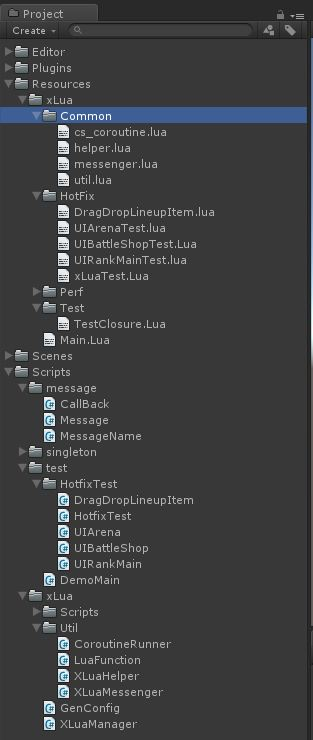

> Unity3D游戏轻量级xlua热修复框架 
> 作者：SChivas
> [原文链接](https://www.cnblogs.com/SChivas/p/7893048.html)

# 一、这是什么东西
前阵子刚刚集成xlua到项目，目的只有一个：对线上游戏 C# 逻辑有Bug的地方执行修复，通过考察xlua和tolua，最终选择了xlua，很大部分原因是因为项目已经到了后期，线上版本迭代了好几次，所以引入Lua的目的不是为了开发新版本模块。xlua在我们的这种情况下很是适用，如xlua作者所说，用C#开发，用lua热更，xlua这套框架为我们提供了诸多便利，至少我可以说，在面临同样的情况下，你用tolua去做同样的事情是很费心的。但是如果你是想用xlua做整套客户端游戏逻辑的，这篇文对你可能就没什么借鉴意义了。其实纯lua写逻辑，使用xlua还是tolua并不是那么重要，因为与c#交互会少很多，而且一般都是耗性能的地方才放c#，即使网上有各种lua框架性能的评测，其实我感觉意义都不太大，如果真要频繁调用，那不管xlua还是tolua你都要考虑方案去优化的。

当时在做完这个xlua热更框架，本打算写篇博文分享一下。后来，由于工作一直比较忙，这个事情就被搁浅了下来，另外，集成xlua时自己写的代码少得可伶，感觉也没什么太多要分享的地方。毕竟热修复，本质上来说就是一个轻量级的东西。除非你是新开的项目，一开始就遵循xlua热更的各种规范。而如果你是后期引入的xlua，那么，xlua热修复代码的复杂度，很大程度上取决于你框架原先c#代码的写法，比如说委托的使用，在c#侧经常作为回调去使用，xlua的demo里对委托的热修复示例是这样的：

 ```cs
public Action<string> TestDelegate = (param) =>
{
    Debug.Log("TestDelegate in c#:" + param);
};

public void TestFunction(Action<string> callback)
{
    //do something
    callback("this is a test string");
    //do something
}

public void TestCall()
{
    TestFunction(TestDelegate);
}
```

这里相当于把委托定义为了成员变量，那么你在lua侧，如果要热修复TestCall函数，要将这个委托作为回调传递给TestFunction，只需要使用self.TestDelegate就能访问，很简单。而问题就在于，我们项目之前对委托的使用方式是这样的：

 
```cs
public void TestDelegate(String param)
{
    Debug.Log("TestDelegate in c#:" + param);
}

public void TestFunction(Action<string> callback)
{
    //do something
    callback("this is a test string");
    //do something
}

public void TestCall()
{
    TestFunction(TestDelegate);
}
```

那么问题就来了，这个TestDelegate是一个函数，在调用的时候才自动创建了一个临时委托，那么Lua侧，你就没办法简单地去热更了，怎么办？这里我要说的就是类似这样的一些问题，因为一开始没有考虑过进行xlua热更，所以导致没有明确匹配xlua热更规则的相关代码规范，从而修复困难。

这个例子可能举得不是太好，你可以暴力修改项目中所有这样写法的地方（只要你乐意- -），另外，下面的这种写法有GC问题，这个问题是项目历史遗留下来的。

# 二、现行xlua分享的弊端
当初在集成xlua到项目时，发现现行网络上对xlua的大多分享，没有直接命中我所面临的问题，有实际借鉴意义的项目不多，对很多分享来说：

1. 体积太重：集成了各种资源热更新、场景管理、音乐管理、定时器管理等等边缘模块，xlua内容反而显得太轻。
2. 避重就轻：简单集成xlua，然后自己用NGUI或者UGUI写了个小demo，完事。

# 三、轻量级xlua热修复框架
其实说是xlua的一个扩展更加贴切，对xlua没有提供的一些外围功能进行了扩展。xlua的设计还是挺不错的，相比tolua的代码读起来还是要清爽多了。

## 3.1 框架工程结构
我假设你已经清楚了xlua做热修复的基本流程，因为下面不会对xlua本身的热更操作做太多说明。先一张本工程的截图(xlua热修复框架工程结构)：



1. Scripts/xlua/XLuaManager：xlua热修复环境，包括luaState管理，自定义loader。
2. Resources/xlua/Main.lua：xlua热修复入口
3. Resources/xlua/Common：提供给lua代码使用的一些工具方法，提供lua逻辑代码到C#调用的一层封装
4. Scripts/xlua/Util：为xlua的lua脚本提供的C#侧代码支持，被Resources/xlua/Common所使用
5. Scripts/test/HotfixTest：需要热修复的c#脚本
6. Resources/xlua/HotFix：热修复脚本

需要说明的一点是，这里所有的热修复示例我都没有单独去做demo演示了，其实如果你真的需要，自己去写测试也没多大问题，所有Lua热更对应的C#逻辑都在，好进行对比。本文主要说的方向有这么几点：

1. 消息系统：打通cs和lua侧的消息系统，其中的关键问题是泛型委托
2. 对象创建：怎么样在lua侧创建cs对象，特别是泛型对象
3. 迭代器：cs侧列表、字典之类的数据类型，怎样在lua侧泛型迭代
4. 协程：cs侧协程怎么热更，怎么在lua侧创建协程
5. 委托作为回调：cs侧函数用作委托回调，当作函数调用的形参时，怎样在lua侧传递委托形参

## 3.2 lua侧cs泛型对象创建
对象创建xlua给的例子很简单，直接new CS.XXX就好，但是如果你要创建一个泛型List对象，比如List<string>，要怎么弄？你可以为List<sting>在c#侧定义一个静态辅助类，提供类似叫CreateListString的函数去创建，但是你不可能为所有的类型都定义这样一层包装吧。所以，问题的核心是，我们怎么样在Lua侧只知道类型信息，就能让cs代劳给我们创建出对象：

```lua
--common.helper.lua
-- new泛型array
local function new_array(item_type, item_count)
    return CS.XLuaHelper.CreateArrayInstance(item_type, item_count)
end

-- new泛型list
local function new_list(item_type)
    return CS.XLuaHelper.CreateListInstance(item_type)
end

-- new泛型字典
local function new_dictionary(key_type, value_type)
    return CS.XLuaHelper.CreateDictionaryInstance(key_type, value_type)
end
```
 
这是`Resources/xlua/Common`下的helper脚本其中的一部分，接下来的脚本我都会在开头写上模块名，不再做说明。这个目录下的代码为lua逻辑层代码提过对cs代码访问的桥接，这样做有两个好处：第一个是隐藏实现细节，第二个是容易更改实现。这里的三个接口都使用到了Scripts/xlua/Util下的XLuaHelper来做真实的事情。这两个目录下的脚本大概的职责都是这样的，Resources/xlua/Common封装lua调用，如果能用lua脚本实现，那就实现，不能实现，那在Resources/xlua/Common写cs脚本提供支持。下面是cs侧相关代码：

```cs
// CS.XLuaHelper
// 说明：扩展CreateInstance方法
public static Array CreateArrayInstance(Type itemType, int itemCount)
{
    return Array.CreateInstance(itemType, itemCount);
}

public static IList CreateListInstance(Type itemType)
{
    return (IList)Activator.CreateInstance(MakeGenericListType(itemType));
}

public static IDictionary CreateDictionaryInstance(Type keyType, Type valueType)
{
    return (IDictionary)Activator.CreateInstance(MakeGenericDictionaryType(keyType, valueType));
}
```

## 3.3 lua侧cs迭代器访问
xlua作者在demo中给出了示例，只是个人觉得用起来麻烦，所以包装了一层语法糖，lua代码如下：

```lua
-- common.helper.lua
-- cs列表迭代器：含包括Array、ArrayList、泛型List在内的所有列表
local function list_iter(cs_ilist, index)
    index = index + 1
    if index < cs_ilist.Count then
        return index, cs_ilist[index]
    end
end

local function list_ipairs(cs_ilist)
    return list_iter, cs_ilist, -1
end

-- cs字典迭代器
local function dictionary_iter(cs_enumerator)
    if cs_enumerator:MoveNext() then
        local current = cs_enumerator.Current
        return current.Key, current.Value
    end
end

local function dictionary_ipairs(cs_idictionary)
    local cs_enumerator = cs_idictionary:GetEnumerator()
    return dictionary_iter, cs_enumerator
end
```

这部分代码不需要额外的cs脚本提供支持，只是实现了lua的泛型迭代，能够用在lua的for循环中，使用代码如下（只给出列表示例，对字典是类似的）：

```lua
-- common.helper.lua
-- Lua创建和遍历泛型列表示例
local helper = require 'common.helper'
local testList = helper.new_list(typeof(CS.System.String))
testList:Add('111')
testList:Add('222')
testList:Add('333')
print('testList', testList, testList.Count, testList[testList.Count - 1])

-- 注意:循环区间为闭区间[0,testList.Count - 1]
-- 适用于列表子集（子区间）遍历
for i = 0, testList.Count - 1 do
    print('testList', i, testList[i])
end

-- 说明：工作方式与上述遍历一样，使用方式上雷同lua库的ipairs，类比于cs的foreach
-- 适用于列表全集（整区间）遍历，推荐，很方便
-- 注意：同cs的foreach，遍历函数体不能修改i,v，否则结果不可预料
for i, v in helper.list_ipairs(testList) do
    print('testList', i, v)
end
```

要看懂这部分的代码，需要知道lua中的泛型for循环是怎么样工作的：

```lua
for var_1, ..., var_n in explist do 
    block 
end
```
 
对于如上泛型for循环通用结构，其代码等价于：

```lua
do
    local _f, _s, _var = explist
    while true do
        local var_1, ... , var_n = _f(_s, _var)
        _var = var_1
        if _var == nil then break end
        block
    end
end
```
 
泛型for循环的执行过程如下：
- 首先，初始化，计算 in 后面表达式的值，表达式应该返回范性 for 需要的三个值：迭代函数_f，状态常量_s和控制变量_var；与多值赋值一样，如果表达式返回的结果个数不足三个会自动用 nil 补足，多出部分会被忽略。
- 第二，将状态常量_s和控制变量_var作为参数调用迭代函数_f（注意：对于 for 结构来说，状态常量_s没有用处，仅仅在初始化时获取他的值并传递给迭代函数_f）。
- 第三，将迭代函数_f返回的值赋给变量列表。
- 第四，如果返回的第一个值为 nil 循环结束，否则执行循环体。
- 第五，回到第二步再次调用迭代函数。

如果控制变量的初始值是 a0，那么控制变量将循环：a1=_f(_s,a0)、a2=_f(_s,a1)、……，直到 ai=nil。对于如上列表类型的迭代，其中explist = list_ipairs(cs_ilist)，根据第一点，可以得到_f = list_iter，_s = cs_ilist, _var = -1，然后进入while死循环，此处每次循环拿_s = cs_ilist, _var = -1作为参数调用_f = list_iter，_f = list_iter内部对_var执行自增，所以这里的_var就是一个计数变量，也是list的index下标，返回值index、cs_ilist[index]赋值给for循环中的i、v，当遍历到列表末尾时，两个值都被赋值为nil，循环结束。这个机制和cs侧的foreach使用迭代器的工作机制是有点雷同的，如果你清楚这个机制，那么这里的原理就不难理解。

## 3.4 lua侧cs协程热更

先看cs侧协程的用法：
 
```cs
// cs.UIRankMain
public override void Open(object param, UIPathData pathData)
{
    // 其它代码省略
    StartCoroutine(TestCorotine(3));
}

IEnumerator TestCorotine(int sec)
{
    yield return new WaitForSeconds(sec);
    Logger.Log(string.Format("This message appears after {0} seconds in cs!", sec));
    yield break;
}
```
 
很普通的一种协程写法，下面对这个协程的调用函数Open，协程函数体TestCorotine执行热修复：

```lua
-- HotFix.UIRankMainTest.lua
-- 模拟Lua侧的异步回调
local function lua_async_test(seconds, coroutine_break)
    print('lua_async_test '..seconds..' seconds!')
    -- TODO：这里还是用Unity的协程相关API模拟异步，有需要的话再考虑在Lua侧实现一个独立的协程系统
    yield_return(CS.UnityEngine.WaitForSeconds(seconds))
    coroutine_break(true, seconds)
end

-- lua侧新建协程：本质上是在Lua侧建立协程，然后用异步回调驱动，
local corotineTest = function(self, seconds)
    print('NewCoroutine: lua corotineTest', self)
    
    local s = os.time()
    print('coroutine start1 : ', s)
    -- 使用Unity的协程相关API：实际上也是CS侧协程结束时调用回调，驱动Lua侧协程继续往下跑
    -- 注意：这里会在CS.CorotineRunner新建一个协程用来等待3秒，这个协程是和self没有任何关系的
    yield_return(CS.UnityEngine.WaitForSeconds(seconds))
    print('coroutine end1 : ', os.time())
    print('This message1 appears after '..os.time() - s..' seconds in lua!')
    
    local s = os.time()
    print('coroutine start2 : ', s)
    -- 使用异步回调转同步调用模拟yield return
    -- 这里使用cs侧的函数也是可以的，规则一致：最后一个参数必须是一个回调，回调被调用时表示异步操作结束
    -- 注意：
    --    1、如果使用cs侧函数，必须将最后一个参数的回调（cs侧定义为委托）导出到[CSharpCallLua]
    --    2、用cs侧函数时，返回值也同样通过回调（cs侧定义为委托）参数传回
    local boolRetValue, secondsRetValue = util.async_to_sync(lua_async_test)(seconds)
    print('coroutine end2 : ', os.time())
    print('This message2 appears after '..os.time() - s..' seconds in lua!')
    -- 返回值测试
    print('boolRetValue:', boolRetValue, 'secondsRetValue:', secondsRetValue)
end

-- 协程热更示例
xlua.hotfix(CS.UIRankMain, 'Open', function(self, param, pathData)
    print('HOTFIX:Open ', self)
    -- 省略其它代码
    -- 方式一：新建Lua协程，优点：可新增协程；缺点：使用起来麻烦
    print('----------async call----------')
    util.coroutine_call(corotineTest)(self, 4)--相当于CS的StartCorotine，启动一个协程并立即返回
    print('----------async call end----------')
    
    -- 方式二：沿用CS协程，优点：使用方便，可直接热更协程代码逻辑，缺点：不可以新增协程
    self:StartCoroutine(self:TestCorotine(3))
end)

-- cs侧协程热更
xlua.hotfix(CS.UIRankMain, 'TestCorotine', function(self, seconds)
    print('HOTFIX:TestCorotine ', self, seconds)
    --注意：这里定义的匿名函数是无参的，全部参数以闭包方式传入
    return util.cs_generator(function()
        local s = os.time()
        print('coroutine start3 : ', s)
        --注意：这里直接使用coroutine.yield，跑在self这个MonoBehaviour脚本中
        coroutine.yield(CS.UnityEngine.WaitForSeconds(seconds))
        print('coroutine end3 : ', os.time())
        print('This message3 appears after '..os.time() - s..' seconds in lua!')
    end)
end)
```

代码看起来有点复杂，但是实际上要说的点都在代码注释中了。xlua作者已经对协程做了比较好的支持，不需要我们另外去操心太多。

## 3.5 lua侧创建cs委托回调
这里回归的是篇头所阐述的问题，当cs侧某个函数的参数是一个委托，而调用方在cs侧直接给了个函数，在lua侧怎么去热更的问题，先给cs代码：

```cs
// cs.UIArena
private void UpdateDailyAwardItem(List<BagItemData> itemList)
{
    if (itemList == null)
    {
        return;
    }

    for (int i = 0; i < itemList.Count; i++)
    {
        UIGameObjectPool.instance.GetGameObject(ResourceMgr.RESTYPE.UI, TheGameIds.UI_BAG_ITEM_ICON, new GameObjectPool.CallbackInfo(onBagItemLoad, itemList[i], Vector3.zero, Vector3.one * 0.65f, m_awardGrid.gameObject));
    }
    m_awardGrid.Reposition();
}
```
 
这是UI上面普通的一段异步加载背包Item的Icon资源问题，资源层异步加载完毕以后回调到当前脚本的onBagItemLoa函数对UI资源执行展示。现在就这段代码执行一下热修复：

```lua 
-- HotFix.UIArenaTese.lua
-- 回调热更示例（消息系统的回调除外）
--    1、缓存委托
--    2、Lua绑定（实际上是创建LuaFunction再cast到delegate），需要在委托类型上打[CSharpCallLua]标签--推荐
--    3、使用反射再执行Lua绑定
xlua.hotfix(CS.UIArena, 'UpdateDailyAwardItem', function(self, itemList)
    print('HOTFIX:UpdateDailyAwardItem ', self, itemList)
    
    if itemList == nil then
        do return end
    end
    
    for i, item in helper.list_ipairs(itemList) do
        -- 方式一：使用CS侧缓存委托
        local callback1 = self.onBagItemLoad
        -- 方式二：Lua绑定
        local callback2 = util.bind(function(self, gameObject, object)
            self:OnBagItemLoad(gameObject, object)
        end, self)
        -- 方式三：
        --    1、使用反射创建委托---这里没法直接使用，返回的是Callback<,>类型，没法隐式转换到CS.GameObjectPool.GetGameObjectDelegate类型
        --    2、再执行Lua绑定--需要在委托类型上打[CSharpCallLua]标签
        -- 注意：
        --    1、使用反射创建的委托可以直接在Lua中调用，但作为参数时，必须要求参数类型一致，或者参数类型为Delegate--参考Lua侧消息系统实现
        --    2、正因为存在类型转换问题，而CS侧的委托类型在Lua中没法拿到，所以在Lua侧执行类型转换成为了不可能，上面才使用了Lua绑定
        --    3、对于Lua侧没法执行类型转换的问题，可以在CS侧去做，这就是[CSharpCallLua]标签的作用，xlua底层已经为我们做好这一步
        --    4、所以，这里相当于方式二多包装了一层委托，从这里可以知道，委托做好全部打[CSharpCallLua]标签，否则更新起来很受限
        --    5、对于Callback和Action类型的委托（包括泛型）都在CS.XLuaHelper实现了反射类型创建，所以不需要依赖Lua绑定，可以任意使用
        -- 静态函数测试
        local delegate = helper.new_callback(typeof(CS.UIArena), 'OnBagItemLoad2', typeof(CS.UnityEngine.GameObject), typeof(CS.System.Object))
        delegate(self.gameObject, nil)
        -- 成员函数测试
        local delegate = helper.new_callback(self, 'OnBagItemLoad', typeof(CS.UnityEngine.GameObject), typeof(CS.System.Object))
        local callback3 = util.bind(function(self, gameObject, object)
            delegate(gameObject, object)
        end, self)
        
        -- 其它测试：使用Lua绑定添加委托：必须[CSharpCallLua]导出委托类型，否则不可用
        callback5 = callback1 + util.bind(function(self, gameObject, object)
            print('callback4 in lua', self, gameObject, object)
        end, self)
        
        local callbackInfo = CS.GameObjectPool.CallbackInfo(callback3, item, Vector3.zero, Vector3.one * 0.65, self.m_awardGrid.gameObject)
        CS.UIGameObjectPool.instance:GetGameObject(CS.ResourceMgr.RESTYPE.UI, CS.TheGameIds.UI_BAG_ITEM_ICON, callbackInfo)
    end
    self.m_awardGrid:Reposition()
end)
```
 

有三种可行的热修复方式：
1. 缓存委托：就是在cs侧不要直接用函数名来作为委托参数传递（会临时创建一个委托），而是在cs侧用一个成员变量缓存委托，并使用函数初始化它，使用时直接self.xxx访问。
2. Lua绑定：创建一个闭包，需要在cs侧的委托类型上打上[CSharpCallLua]标签，实际上xlua作者建议将工程中所有的委托类型打上这个标签。
3. 使用反射再执行lua绑定：这种方式使用起来很受限，这里不再做说明，要了解的朋友自己参考源代码。

## 3.6 打通lua和cs的消息系统
cs侧消息系统使用的是这个：http://wiki.unity3d.com/index.php/Advanced_CSharp_Messenger。里面使用了泛型编程的思想，xlua作者在demo中针对泛型接口的热修复给出的建议是实现扩展函数，但是扩展函数需要对一个类型去做一个接口，这里的消息系统类型完全是可以任意的，显然这种方案显得捉襟见肘。核心的问题只有一个，怎么根据参数类型信息去动态创建委托类型。

委托类型其实是一个数据结构，它引用静态方法或引用类实例及该类的实例方法。在我们定义一个委托类型时，C#会创建一个类，有点类似C++函数对象的概念，但是它们还是相差很远，由于时间和篇幅关系，这里不再做太多说明。总之这个数据结构在lua侧是无法用类似CS.XXX去访问到的，正因为如此，所以才为什么所有的委托类型都需要打上[CSharpCallLua]标签去做一个映射表。lua不能访问到cs委托类型，没关系，我们可以在cs侧创建出来就行了。而Delegate 类是委托类型的基类，所有的泛型委托类型都可通过它进行函数调用的参数传递，解决泛型委托的传参问题。先看下lua怎么用这个消息系统：

 
```lua
-- HotFix.UIArenaTest.lua
-- Lua消息响应
local TestLuaCallback = function(self, param)
    print('LuaDelegateTest: ', self, param, param and param.rank)
end

local TestLuaCallback2 = function(self, param)
    print('LuaDelegateTest: ', self, param, param and param.Count)
end

-- 添加消息示例
xlua.hotfix(CS.UIArena, 'AddListener', function(self)
    ---------------------------------消息系统热更测试---------------------------------
    -- 用法一：使用cs侧函数作为回调，必须在XLuaMessenger导出，无法新增消息监听，不支持重载函数
    messenger.add_listener(CS.MessageName.MN_ARENA_PERSONAL_PANEL, self, self.UpdatePanelInfo)
    
    -- 用法二：使用lua函数作为回调，必须在XLuaMessenger导出，可以新增任意已导出的消息监听
    messenger.add_listener(CS.MessageName.MN_ARENA_PERSONAL_PANEL, self, TestLuaCallback)
    
    -- 用法三：使用CS侧成员委托，无须在XLuaMessenger导出，可以新增同类型的消息监听，CS侧必须缓存委托
    messenger.add_listener(CS.MessageName.MN_ARENA_UPDATE, self.updateLeftTimes)
    
    -- 用法四：使用反射创建委托，无须在XLuaMessenger导出，CS侧无须缓存委托，灵活度高，效率低，支持重载函数
    -- 注意：如果该消息在CS代码中没有使用过，则最好打[ReflectionUse]标签，防止IOS代码裁剪
    messenger.add_listener(CS.MessageName.MN_ARENA_BOX, self, 'SetBoxState', typeof(CS.System.Int32))
end)

-- 移除消息示例
xlua.hotfix(CS.UIArena, 'RemoveListener', function(self)
    -- 用法一
    messenger.remove_listener(CS.MessageName.MN_ARENA_PERSONAL_PANEL, self, self.UpdatePanelInfo)
    
    -- 用法二
    messenger.remove_listener(CS.MessageName.MN_ARENA_PERSONAL_PANEL, self, TestLuaCallback)
    
    -- 用法三
    messenger.remove_listener(CS.MessageName.MN_ARENA_UPDATE, self.updateLeftTimes)
    
    -- 用法四
    messenger.remove_listener(CS.MessageName.MN_ARENA_BOX, self, 'SetBoxState', typeof(CS.System.Int32))
end)

-- 发送消息示例
util.hotfix_ex(CS.UIArena, 'OnGUI', function(self)
    if Button(Rect(100, 300, 150, 80), 'lua BroadcastMsg1') then
        local testData = CS.ArenaPanelData()--正确
        --local testData = helper.new_object(typeof(CS.ArenaPanelData))--正确
        testData.rank = 7777;
        messenger.broadcast(CS.MessageName.MN_ARENA_PERSONAL_PANEL, testData)
    end
    
    if Button(Rect(100, 400, 150, 80), 'lua BroadcastMsg3') then
        local testData = CS.ArenaPanelData()
        testData.rank = 7777;
        messenger.broadcast(CS.MessageName.MN_ARENA_UPDATE, testData)
    end

    if Button(Rect(100, 500, 150, 80), 'lua BroadcastMsg4') then
        messenger.broadcast(CS.MessageName.MN_ARENA_BOX, 3)
    end
    self:OnGUI()
end)
```
 
从lua侧逻辑层来说，有4种使用方式：

1. 使用cs侧函数作为回调：直接使用cs侧的函数作为回调，传递self.xxx函数接口，必须在XLuaMessenger导出，无法新增消息监听，不支持重载函数，XLuaMessenger稍后再做说明
2. 使用lua函数作为回调：在lua侧定义函数作为消息回调，必须在XLuaMessenger导出，可以新增任意已导出的消息监听
3. 使用CS侧成员委托：无须在XLuaMessenger导出，可以新增同类型的消息监听，CS侧必须缓存委托，这个之前也说了，委托作为类成员变量缓存，很方便在lua中使用
4. 使用反射创建委托：就是根据参数类型动态生成委托类型，无须在XLuaMessenger导出，CS侧无须缓存委托，灵活度高，效率低，支持重载函数。需要注意的是该委托类型一定要没有被裁剪

从以上4种使用方式来看，lua层逻辑代码使用消息系统十分简单，且灵活性很大。lua侧的整套消息系统用common.messenger.lua辅助实现，看下代码：

```lua 
-- common.messenger.lua
-- added by wsh @ 2017-09-07 for Messenger-System-Proxy
-- lua侧消息系统，基于CS.XLuaMessenger导出类，可以看做是对CS.Messenger的扩展，使其支持Lua

local unpack = unpack or table.unpack
local util = require 'common.util'
local helper = require 'common.helper'
local cache = {}

local GetKey = function(...)
    local params = {...}
    local key = ''
    for _,v in ipairs(params) do
        key = key..'\t'..tostring(v)
    end
    return key
end

local GetCache = function(key)
    return cache[key]
end

local SetCache = function(key, value)
    assert(GetCache(key) == nil, 'already contains key '..key)
    cache[key] = value
end

local ClearCache = function(key)
    cache[key] = nil
end

local add_listener_with_delegate = function(messengerName, cs_del_obj)
    CS.XLuaMessenger.AddListener(messengerName, cs_del_obj)
end

local add_listener_with_func = function(messengerName, cs_obj, func)
    local key = GetKey(cs_obj, func)
    local obj_bind_callback = GetCache(key)
    if obj_bind_callback == nil then
        obj_bind_callback = util.bind(func, cs_obj)
        SetCache(key, obj_bind_callback)
        
        local lua_callback = CS.XLuaMessenger.CreateDelegate(messengerName, obj_bind_callback)
        CS.XLuaMessenger.AddListener(messengerName, lua_callback)
    end
end

local add_listener_with_reflection = function(messengerName, cs_obj, method_name, ...)
    local cs_del_obj = helper.new_callback(cs_obj, method_name, ...)
    CS.XLuaMessenger.AddListener(messengerName, cs_del_obj)
end

local add_listener = function(messengerName, ...)
    local params = {...}
    assert(#params >= 1, 'error params count!')
    if #params == 1 then
        add_listener_with_delegate(messengerName, unpack(params))
    elseif #params == 2 and type(params[2]) == 'function' then
        add_listener_with_func(messengerName, unpack(params))
    else
        add_listener_with_reflection(messengerName, unpack(params))
    end
end

local broadcast = function(messengerName, ...)
    CS.XLuaMessenger.Broadcast(messengerName, ...)
end

local remove_listener_with_delegate = function(messengerName, cs_del_obj)
    CS.XLuaMessenger.RemoveListener(messengerName, cs_del_obj)
end

local remove_listener_with_func = function(messengerName, cs_obj, func)
    local key = GetKey(cs_obj, func)
    local obj_bind_callback = GetCache(key)
    if obj_bind_callback ~= nil then
        ClearCache(key)
        
        local lua_callback = CS.XLuaMessenger.CreateDelegate(messengerName, obj_bind_callback)
        CS.XLuaMessenger.RemoveListener(messengerName, lua_callback)
    end
end

local remove_listener_with_reflection = function(messengerName, cs_obj, method_name, ...)
    local cs_del_obj = helper.new_callback(cs_obj, method_name, ...)
    CS.XLuaMessenger.RemoveListener(messengerName, cs_del_obj)
end

local remove_listener = function(messengerName, ...)
    local params = {...}
    assert(#params >= 1, 'error params count!')
    if #params == 1 then
        remove_listener_with_delegate(messengerName, unpack(params))
    elseif #params == 2 and type(params[2]) == 'function' then
        remove_listener_with_func(messengerName, unpack(params))
    else
        remove_listener_with_reflection(messengerName, unpack(params))
    end
end

return {
    add_listener = add_listener,
    broadcast = broadcast,
    remove_listener = remove_listener,
}
``` 

有以下几点需要说明：

1. 各个接口内部实现通过参数个数和参数类型实现重载，以下只对add_listener系列接口给出说明
2. add_listener_with_delegate接受的参数直接是一个cs侧的委托对象，在lua侧不做任何特殊处理。对应上述的使用方式三
3. add_listener_with_func接受参数是一个cs侧的对象，和一个函数，内部使用这两个信息创建闭包，传递给cs侧的是一个LuaFunction作为回调。对应上述的使用方式一和使用方式二
4. add_listener_with_reflection接受的是一个cs侧的对象，外加一个cs侧的函数，或者是函数的名字和参数列表。对应的是使用方式四

add_listener_with_delegate最简单；add_listener_with_func通过创建闭包，再将闭包函数映射到cs侧委托类型来创建委托；add_listener_with_reflection通过反射动态创建委托。所有接口的共通点就是想办法去创建委托，只是来源不一样。下面着重看下后两种方式是怎么实现的。

对于反射创建委托，相对来说要简单一点，helper.new_callback最终会调用到XLuaHelper.cs中去，相关代码如下：

```cs
// cs.XLuaHelper
// 说明：创建委托
// 注意：重载函数的定义顺序很重要：从更具体类型（Type）到不具体类型（object）,xlua生成导出代码和lua侧函数调用匹配时都是从上到下的，如果不具体类型（object）写在上面，则永远也匹配不到更具体类型（Type）的重载函数，很坑爹
public static Delegate CreateActionDelegate(Type type, string methodName, params Type[] paramTypes)
{
    return InnerCreateDelegate(MakeGenericActionType, null, type, methodName, paramTypes);
}

public static Delegate CreateActionDelegate(object target, string methodName, params Type[] paramTypes)
{
    return InnerCreateDelegate(MakeGenericActionType, target, null, methodName, paramTypes);
}

public static Delegate CreateCallbackDelegate(Type type, string methodName, params Type[] paramTypes)
{
    return InnerCreateDelegate(MakeGenericCallbackType, null, type, methodName, paramTypes);
}

public static Delegate CreateCallbackDelegate(object target, string methodName, params Type[] paramTypes)
{
    return InnerCreateDelegate(MakeGenericCallbackType, target, null, methodName, paramTypes);
}

delegate Type MakeGenericDelegateType(params Type[] paramTypes);
static Delegate InnerCreateDelegate(MakeGenericDelegateType del, object target, Type type, string methodName, params Type[] paramTypes)
{
    if (target != null)
    {
        type = target.GetType();
    }

    BindingFlags bindingFlags = BindingFlags.Public | BindingFlags.NonPublic | BindingFlags.Instance | BindingFlags.Static;
    MethodInfo methodInfo = (paramTypes == null || paramTypes.Length == 0) ? type.GetMethod(methodName, bindingFlags) : type.GetMethod(methodName, bindingFlags, null, paramTypes, null);
    Type delegateType = del(paramTypes);
    return Delegate.CreateDelegate(delegateType, target, methodInfo);
}
```

这部分代码就是利用反射创建委托类型，xlua作者在lua代码中也有实现。接下来的是怎么利用LuaFunction去创建委托，看下XLuaMesseneger.cs中创建委托的代码：
```cs
public static Dictionary<string, Type> MessageNameTypeMap = new Dictionary<string, Type>() {
    // UIArena测试模块
    { MessageName.MN_ARENA_PERSONAL_PANEL, typeof(Callback<ArenaPanelData>) },//导出测试
    { MessageName.MN_ARENA_UPDATE, typeof(Callback<ArenaPanelData>) },//缓存委托测试
    { MessageName.MN_ARENA_BOX, typeof(Callback<int>) },//反射测试
};

[LuaCallCSharp]
public static List<Type> LuaCallCSharp = new List<Type>() {
    // XLuaMessenger
    typeof(XLuaMessenger),
    typeof(MessageName),
};

[CSharpCallLua]
public static List<Type> CSharpCallLua1 = new List<Type>() {
};

// 由映射表自动导出
[CSharpCallLua]
public static List<Type> CSharpCallLua2 = Enumerable.Where(MessageNameTypeMap.Values, type => typeof(Delegate).IsAssignableFrom(type)).ToList();

public static Delegate CreateDelegate(string eventType, LuaFunction func)
{
    if (!MessageNameTypeMap.ContainsKey(eventType))
    {
        Debug.LogError(string.Format("You should register eventType : {0} first!", eventType));
        return null;
    }
    return func.Cast(MessageNameTypeMap[eventType]);
}
``` 

我这里用消息类型（String）和消息对应的委托类型做了一次表映射，lua侧传递LuaFunction过来时，通过消息类型就可以知道要Cast到什么类型的委托上面。而xlua中的原理是导出的委托类型存为列表，当LuaFunction要映射到委托类型时，遍历这张表找一个参数类型匹配的委托进行映射。

其它的应该都比较简单了，XLuaMessenger.cs是对Messenger.cs做了扩展，使其支持object类型参数，主要是提供对Lua侧发送消息的支持，截取其中一个函数来做下展示：

```cs
public static void Broadcast(string eventType, object arg1, object arg2)
{
    Messenger.OnBroadcasting(eventType);

    Delegate d;
    if (Messenger.eventTable.TryGetValue(eventType, out d))
    {
        try
        {
            Type[] paramArr = d.GetType().GetGenericArguments();
            object param1 = arg1;
            object param2 = arg2;
            if (paramArr.Length >= 2)
            {
                param1 = CastType(paramArr[0], arg1) ?? arg1;
                param2 = CastType(paramArr[1], arg2) ?? arg2;
            }
            d.DynamicInvoke(param1, param2);
        }
        catch (System.Exception ex)
        {
            Debug.LogError(string.Format("{0}:{1}", ex.Message, string.Format("arg1 = {0}, typeof(arg1) = {1}, arg2 = {2}, typeof(arg2) = {3}", arg1, arg1.GetType(), arg2, arg2.GetType())));
            throw Messenger.CreateBroadcastSignatureException(eventType);
        }
    }
}
```
 

# 四、xlua动态库构建
要说的重点就这些，需要说明的一点是，这里并没有把项目中所有的东西放上来，因为xlua的热更真的和被热更的cs项目有很大的直接牵连，还是拿篇头那个委托热更的例子做下说明：如果你cs项目代码规范就就已经支持了xlua热更，那本文中很多关于委托热更的讨论你根本就用不上。但是这里给的代码组织结构和解决问题的思路还是很有参考性的，实践时你项目中遇到某些难以热更的模块，可以参考这里消息系统的设计思路去解决。

另外，之前看xlua讨论群里还有人问怎么构建xlua动态库，或者怎么集成第三方插件。这个问题可以参考我的另一篇博客：[Unity3D跨平台动态库编译---记kcp基于CMake的各平台构建实践](http://www.cnblogs.com/SChivas/p/7854100.html)。这里有kcp的构建，其实这是我第一次尝试去编译Unity各平台的动态库经历，整个构建都是参考的xlua构建工程，你看懂并实践成功了kcp的构建，那么xlua的也会了。

# 五、工程项目地址
GitHub 地址在：https://github.com/smilehao/xlua-hotfix-framework
