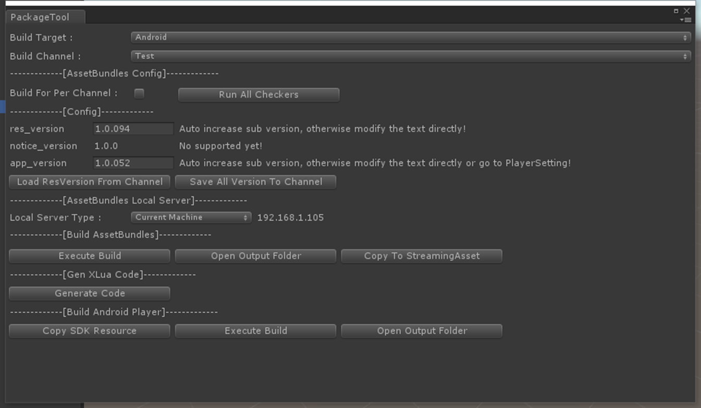
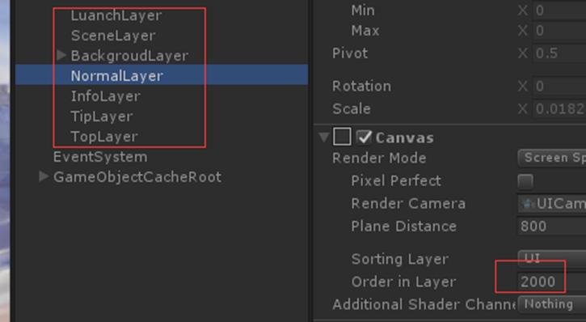
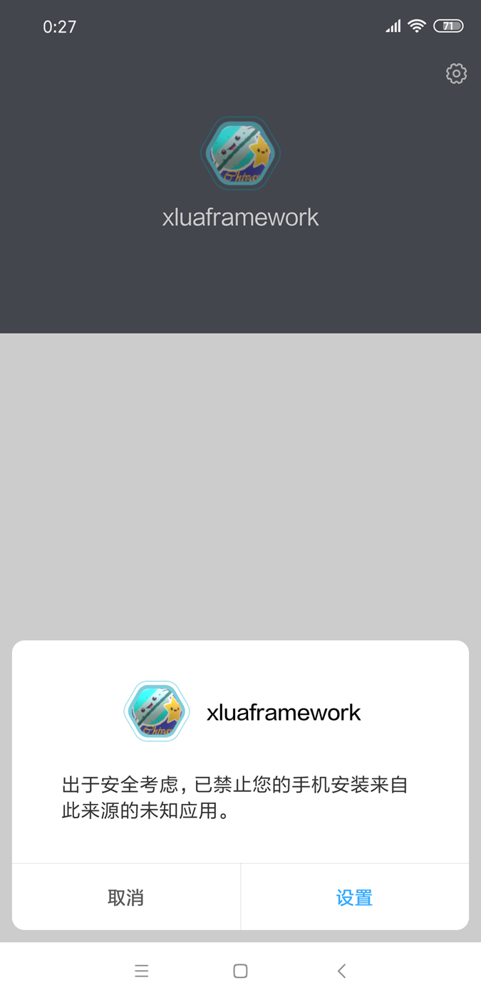

[原文](https://github.com/passiony/xlua-framework-unity2018/blob/master/XLua%E6%A1%86%E6%9E%B6%E8%AE%BE%E8%AE%A1%E6%96%87%E6%A1%A3.docx) 是写在 docx 里的，不方便阅读，转为 markdown 格式发布于此。

# 一、总体设计
## 1.1 概述
基于XLua，整合ToLua的Proto-gen-lua，以及大部分ToLua作者整合的库，除了Assetbundle模块，大部分游戏逻辑全部用lua实现，目前实现的内容包括：
- UI管理模块：使用UGUI，基于MVC架构，View层实现一套组件管理系统，提供类似于Unity侧Mono脚本的调度机制。
- 场景管理模块：场景调度、Loading界面、资源预加载
- 网络模块：ProtoBuff、TCP连接器
- 资源管理模块：打包工具、资源热更、资源加载、资源缓存
- 定时器管理
- 协程管理
- 配置表

## 1.2 工程目录
截图：


说明：
- AssetBundles：AB打包输出目录
- ConfigData：配置表目录
- ProtoToCS：Proto文件目录
- ProtoToLua：proto-gen-lua工作目录
- Qudao：渠道目录
- Tools：XLua工具目录
- Xlua-lib-build：xlua库构建工程（另设Git项目：https://github.com/smilehao/xlua-lib-build。）

Assets目录截图：


Assets目录说明：
- AssetsPackage：取代Resources目录，存放项目资源
- EasyTouchBundle：EasyTouch插件
- Editor：编辑器脚本
- LuaScripts：Lua脚本
- Plugins：插件
- Reporter：真机日志输出插件
- Scenes：场景
- Scropts：CS脚本
- StreamingAssets：AB打包资源

Lua脚本目录截图：


Lua脚本目录说明：
- Common：通用工具脚本，其中Tools目录下的脚本由ToLua迁移过来，其它脚本为自定义的扩展和工具类脚本
- Config目录：配置文件目录，其中Data目录为Lua配置自动生成工具的输出目录
- DataCenter：数据中心
- Framework：框架基础脚本，这部分代码具有一定通用性，与游戏逻辑无关。
- GameLogic：游戏逻辑脚本
- GameTest：游戏测试脚本
- Global：全局配置脚本
- Net：网络逻辑相关脚本
- Resource：资源逻辑相关脚本
- Scenes：场景逻辑相关脚本
- UI：UI逻辑相关脚本
- UnitTest：单元测试
- XLua：XLua热修复脚本，其中HotfixMain.lua为lua热修复逻辑入口。
- GameMain：游戏逻辑入口

Scripts目录截图：


Scripts目录说明：
- XLua：其中Gen为生成脚本、Support为自定义支持脚本
- FrameWork：框架基础脚本
- 其它：Common通用模块、Config配置、GameLaunch游戏入口及资源热更、Platform渠道相关、Test测试和调试相关

## 1.3 游戏启动流程
- 启动场景：LauchScene场景，场景启动后GameLaunch.cs脚本启动
- 启动资源管理模块
- 启动XLua热修复模块
- 启动资源热更新UI
- 资源热更新：如果需要更新，则更新完毕后重启资源管理器和Lua虚拟机（热修复模块）
- 启动游戏：进入Lua脚本执行后续游戏逻辑

## 1.4 运行指导
- 打开游戏工程。注意：本工程由Unity5.3.4f1创建，低版本可能会有问题，使用新版本即可。
- 打开后会有一大堆报错，因为默认是PC平台，需要切换到安卓平台：File->BuildSettings打开如下窗口，选择android，然后点击switch platform切换平台。


- 切换完毕后会自动可能会自动弹出构建AB的窗口，点击Confirm确认，并等待AB打包结束---如果你的机器没有自动弹出这个窗口，请忽略这一步。


- AB打包结束以后会弹出复制AB到StreamingAsset窗口，点击Confirm和Yes确认，并等待复制结束---如果你的机器没有自动弹出这个窗口，请忽略这一步。


- 如果你的机器没有弹窗上述步骤的几个窗口，点击AssetBundles/SwitchMode/Simulate Mode。这个时候会弹出如上几个窗口，同样操作即可。


- 打开Tools/Package窗口如下，并点击Save All Version To Channel保存版本号信息。然后点击Copy To StreamingAsset按钮将版本号信息拷贝到StreamingAsset目录下。弹出的分别点击Confirm和Yes。Build Target选择Android，而Build Channel选择Test：



- 点击Xlua/Hotfix InjectIn Editor，执行Xlua热修复注入。


- 双击打开LaunchScene登录场景，即可运行游戏。点击选服按钮可以弹出选服窗口，登录游戏需要账号密码非空，随便输入即可。


- 以上步骤用于第一次打开该项目工程的操作次序，按步骤先让游戏跑起来即可，具体每个步骤什么意义看后续的资源管理模块说明。

# 二、Lua简介
## 2.1 lua设计语言简介
这部分的内容似乎没有什么需要说明的，文档末尾会给一本入门级别的pdf教程、一本Lua性能优化的pdf教程和云风翻译的lua5.3的参考手册网址。两本教程有必要看一下，参考手册作为字典查阅就好。下面提一下需要重点关注的方面：
- 闭包
- 泛型迭代
- 协程
- 弱表
- Metatables和Metamethods
- 面向对象程序设计
- 整本性能优化pdf中的内容
其它的一些内容，有些是基础内容，比如数据类型等；有些是需要时再做了解不迟，比如标准库；还有些不是特别重要，很少会涉及到，比如序列化。另外需要说明的一点是，这些教程都是基于Lua和C通讯的，而我们用的是和C#通讯（正是XLua做的事情），所以教程或者文档中有关的CAPI一并忽略。

## 2.2 XLua简介
Lua语言运用在游戏中的历史很久了，我看《游戏编程精粹》系列书籍发现90年代国外就已经在用Lua作为脚本语言设计游戏，国内最新引入Lua语言的是云风在网易做端游的时候，他们那个时候还是自己写引擎，用Lua语言主要还是为了保证引擎核心代码的隐秘性，还有就是防止外挂，据说跑在虚拟机中的代码不是那么好逆向。

后来Unity流行，国外就有人把Lua引入了Unity，国内一些人随后拿过来进行改造，做成自己的库并进行优化，比如说早期在Unity中使用Lua全部是用反射机制访问c#接口，后来像tolua作者这批人才改成用wrap方式，再比如自己在Lua侧实现Vector3等向量运行，避免频繁和CS脚本交互来提高性能。

这些个所谓的各种Lua库其实都大同小异，而且使用起来很不方便，如果项目初期没有考虑到用Lua进行设计，那么到项目中后期再想换成Lua几乎是不可能的事情。直到XLua的出现，提出了基于CS开发用Lua做热修复的概念，让中后期的项目整合到Unity做Bug修复成为了开发成本较小的一件事情。

尽管如此，做热修复的限制还是很多，而且不提供对新模块开发的热更支持，所以才有了目前这个框架，用Lua写游戏逻辑。最开始我用的是ToLua，后来发现ToLua的坑实在是有点多，而且有些设计是实在让人难受，比如XLua把所有CS导出脚本导出到CS命名空间，避免和Lua脚本命名冲突，而ToLua却没有设置这个命名空间，关键是它的代码还不好修改；还有些很难受的地方，比如A脚本，生成代码AWrap没有清理掉，这时候修改了A脚本，那么AWrap就会报错，一报错ToLua菜单就失效，失效就要手动清理生成文件，而手动清理不是清空目录这么简单，你要到某个脚本找到相关函数去删除。总之一句话，很难受。所以做到一半，我就把ToLua换成了XLua，并且把ToLua中的一些库（包括pb）整合到了XLua。

Lua运行的机制，简单点可以这么说，Lua脚本跑在Lua虚拟机中，而不管ToLua还是XLua，他们做的事情是把Lua虚拟机源代码整合到动态库供Unity使用，然后在CS中启动虚拟机跑Lua代码，此外，动态库还提供一些支持代码提供给Lua和Unity的交互，这部分支持代码就是ToLua、XLua所做的事情。

关于XLua的工作原理，感觉大部分都没什么好说的，它本身是为了做热修复而设计的，但是作为纯Lua写游戏逻辑的框架，使用ToLua和XLua都行，因为只要提供对Lua语言的全部支持就行。XLua的热修复原理是打Hotfix标签，打上标签的对象或者方法会在IL层挂钩（IL的知识自行网络搜索），这部分原理XLua作者也做过说明；另外要了解的一点是，XLua不像ToLua那样必须导出脚本才能在Lua中使用，XLua遇到没有导出的脚本会自动用反射去访问，所以对于XLua来说，脚本导出只是可以提高性能，另外就是安全性，避免代码裁剪导致iOS上出现Jit错误。

导出的脚本会生成wrap文件，这部分文件在XLua虚拟机启动时，每个文件会生成一张表，这个表相当于提供给Lua侧使用的接口文件，Lua侧访问表中的接口时就可以访问到wrap文件，wrap文件再调用原文件中的实现代码执行真正的逻辑，去反射就是这么来的。

其它的知识点这里不再多做说明，自己阅读源代码，或者访问XLua官网查看相关资料，ToLua也一样，顺便吐槽一点，ToLua作者写的代码没有XLua作者写的清晰，包括protoc-gen-lua都各种问题（这个项目最开始貌似是简悦某个人写的），我甚至都怀疑这东西根本没有经过商业验证。XLua作者模块设计就相当清晰，可扩展性也很好，感兴趣的同学建议仔细读读，学学人家的模块设计为什么会是这个样子。

## 2.3 Unity侧功能的Lua实现
这部分的代码在 `LuaScript/Common/Tools/UnityEngine` 当中，整个Tools目录都是从ToLua中移植过来的，但是大部分功能现在都没用上，主要用到的有：UnityEngine目录下的脚本，以及event脚本（后面在定时器部分介绍）。

UnityEngine下面的脚本使用Lua实现的Unity相关对象，目的是为了提高性能，原理是减少Lua和CS脚本之间的交互。这部分代码由于是从ToLua整合到XLua，所以所有的脚本我都进行了必要的调整，不要从ToLua直接拷贝来升级，下面就这部分脚本的工作原理做下简要说明。

拿Bounds.lua举例（其它的脚本类似）：
- 缓存CS侧导出的Bounds.cs代码：

```lua
local unity_bounds = CS.UnityEngine.Bounds 
Bounds.unity_bounds = CS.UnityEngine.Bounds
```

- 用Lua语言重写整个Bounds对象的逻辑：Bounds.lua脚本中大部分代码就是为了做这事。
- 用Lua实现替换CS侧的导出接口：`CS.UnityEngine.Bounds = Bounds`
- 让Lua对象的metatable指向自身：保证封闭性 `setmetatable(Bounds, Bounds)`
- 实现__index方法：使优先访问Lua实现，如果接口不存在则访问CS导出代码：

```lua
Bounds.__index = function(t,k)
    local var = rawget(Bounds, k)
    if var ~= nil then
        return var
    end	
    var = rawget(_getter, k)
    if var ~= nil then
        return var(t)
    end
    return rawget(unity_bounds, k)
end
```

这部分代码应该十分直白，我就不多做说明了，注意_getter实现的功能类似CS侧的getter访问器。

综上：可以看到，这实际上就是在CS导出代码上套了一层---也可以看做继承关系，子类（Lua实现）没有实现的方法才去访问父类的方法（CS导出代码）。
## 2.3 Lua通用扩展工具类
脚本路径在 `LuaScripts/Common` 目录下，分为三个脚本：LuaUtil、StringUtil和TableUtil，这几个脚本分别是为了扩展Lua语言、String库和Table库的，添加了一些新的功能，具体来说：
#### LuaUtil工具类
- SafePack、SafeUnpack：用于解决原生pack、unpack的nil截断问题（就是传递参数列表时，如果中间某个参数为nil，则后续的参数都会作废的问题）。
- 闭包绑定（Bind）：绑定函数调用时需要传递的对象，以及参数。
- 回调绑定（BindCallback）：同闭包绑定，不同的是可能不需要传递对象
- 字符串转boolean值（ToBoolean）
- 深拷贝对象（DeepCopy）
- 序列化表（Serialize）：这个目前没有用到

各个接口的实现自行阅读源代码，使用方式参考单元测试中的LuaUtilTest.lua。
#### StringUtil工具类
- 字符串分割（split）、拼接（join）
- 字符串包含（contains）
- 以某个字符串开始（startswith）、结尾（endswith）

各个接口的实现自行阅读源代码，使用方式参考单元测试中的StringTest.lua。

#### TableUtil工具类
这个类里的接口比较多，这里不一一罗列，需要注意的是Table作为表时可以当做数组（Array），也可以当做哈希表（hashtable）（注意：实际上Lua语言对Table的实现，在底层会同时存在线性部分的数组和散列部分的哈希表，在某些情况下才是二者挑一），所以这里的接口是分别针对这两种结构的，使用时要确认自己的数据结构到底属于哪种结构。

有一个接口着重说明一下：dump，这个函数是用于以字符串形式输出表中的内容的，用于调试十分方便，如：print(dump(xxx_table))。第一个参数是被dump的table，第二个参数指定如果该表有metatable，是否同时也dump其metatable，第三个参数指定在有嵌套表时需要dump的深度。

各个接口的实现自行阅读源代码，使用方式参考单元测试中的TableUtilTest.lua。

## 2.4 Lua面向对象程序设计
脚本在 LuaScripts/Framework/Common/BaseClass.lua，Lua中使用metatable来实现面向对象设计，这里有两个要点稍微说明一下：
- 类和类实例：Lua中只有表的概念，其实类和类实例都是一张表，对于类来说，定义以后全局范围内只有一张表来标识这个类，类实例就是以这个类为基础创建的一张新表
- 虚表：这里的实现模仿了C++里面向对象的设计方式，对于每个类使用了一张虚表来存放成员和方法。但是，需要注意的是这里与C++数据成员的内存布局是不一样的，C++中的虚表只存放成员函数，而这里也同时存放了数据成员。这个去找下C++虚表的知识点就能很快明白

由于在UI组件系统中，需要在参数中传递组件类型，为了区分参数是类还是类实例，我加了一个ClassType的自定义类型来标识。

其它的基本没什么需要说明的，直接读代码就能明白，BaseClass的测试代码在单元测试中的ClassTest中，这里主要提下面向对象设计中的几个要点：
#### 访问基类数据成员
访问基类数据成员直接使用self.xxx就行。子类新增数据成员在子类对应的虚表中，而父类的数据成员在父类的虚表中（这对成员函数也适用）。当访问一个成员时，如果子类虚表中没有找到该成员，就会去父类中取。
#### 访问基类成员方法
如果一个方法funcA在子类中被override，那么要访问父类的funcA肯定不能直接用self.funcA访问，否则会造成死循环。目前使用的方式是在类定义时显示给base赋值：
```lua
local base = UIBaseView
```

此后，要访问基类的方法时，直接base.funcA就可以了：
```lua
local function OnCreate(self)
	base.OnCreate(self)
end
```

其实还有另外一种等价的方式：
```lua
local function OnCreate(self)
	self._class_type.super.OnCreate(self)
end
```
由于这种方式依赖于self参数，而Lua里我又没发现有C语言中类似使用宏定义的语法，这意味着每次都要敲这么长一句代码，很麻烦，所以就没有使用这种方式。
- 多态（虚函数、重写）
Override很简单，如果父类定义了某个函数FuncA，要重写它，在子类中直接重新定义一个同名函数即可。Lua中的函数没有重载的概念，不管参数个数和类型，不能存在同名函数，所以不会有任何问题。
- 重载
上面说了，Lua函数没有重载的概念，所以如果要自己实现重载，目前的做法是在函数体内部根据参数类型和个数去调用不同的内部子功能函数。这样写让代码可读性会变得比较差，所以建议如果某个函数存在重载，应该把可能的重载形式注释清楚，如：
--添加组件：多种重载方式
-- 1、直接添加Lua侧组件：inst:AddComponent(ComponentTypeClass, luaComponentInst)
-- 2、指定Lua侧组件类型和必要参数，新建组件并添加，多种重载方式：
--    A）inst:AddComponent(ComponentTypeClass, relative_path)
--    B）inst:AddComponent(ComponentTypeClass, child_index)
--    C）inst:AddComponent(ComponentTypeClass, unity_gameObj)
local function AddComponent(self, component_target, var_arg, ...)
	assert(component_target.__ctype == ClassType.class)
	local component_inst = nil
	local component_class = nil
	if type(var_arg) == "table" and var_arg.__ctype == ClassType.instance then
		component_inst = var_arg
		component_class = var_arg._class_type
	else
		component_inst = component_target.New(self, var_arg)
		component_class = component_target
		component_inst:OnCreate(...)
	end
	--其它代码省略
end
- 保护级别
Lua里面可以做到脚本级别的成员保护，分为：私有成员、公有成员。私有成员就是在脚本全局范围内定义的局部变量，而对于表来说，所有成员都是公有的。
    A） 数据成员
私有数据成员，直接在脚本中local定义就行，如上面的基类base赋值语句，这个base就不能在其它脚本被访问到。
公有数据成员，需要写入虚表（对表进行赋值），使用self.xxx就行。
    B） 成员函数
私有成员函数：目前的类定义，所有的函数我都是使用local定义的，使用local定义的function如果不写入虚表，那它就是私有的，这点和数据成员一样。
公有成员函数：如果想暴露某个成员函数成为公有函数，只需要在类定义底部写入虚表即可。
- 全局变量
一般情况下，不建议随便使用全局变量来污染全局空间，而且还有一点，全局变量必须显示删除（赋值nil），否则永远不会被回收。基于模块化设计，建议所有的类定义都使用局部定义的形式，如果某些类为了书写方便需要导出到全局空间，在LuaScripts/Global/Global.lua中进行配置即可。
2.5 Lua数据表和常量表
脚本在LuaScripts/Framework/Common下的DataClass和ConstClass。最开始写Lua的时候，总是遇到数据成员名拼写错误导致错误，然后Lua中不管是读还是写数据，名字拼写错误都不会报错，所以加了这两个类型。数据表DataClass对读写不存在的域时会报错，主要用于自定义的数据结构；而常量表除了拥有数据表的特性，还限制了只读，主要用于配置表。需要注意的是，以上限制只在调试模式下生效（LuaScripts/Global/Config.lua中配置）。
定义格式：DataClass/ConstClass(“dataClassName”, dataTable)
这两种类型的表如果不想用那就不用好了，因为其实在非调试模式下它们就是一张普通的表，只不过在创建表的时候多了一个拷贝数据的操作（可以看做带有默认值的初始化），如果连这个功能也不需要，那和普通的local tb = {}语法在逻辑功能上就没有了任何区别。
具体的实现细节参考源代码就好，我暂时也想不到还有什么东西需要做说明的。
2.6 Lua单例类
Lua单例类脚本在LuaScripts/Framework/Common目录下，分为两个：Singleton.lua和UpdatableSingleton.lua，分别对应CS侧的Singleton.cs和MonoSingleton。
	单例类的实现逻辑比较简单，这里不多做说明，关于可更新脚本Updatable.lua后面会做说明。单例类的定义直接从单例类继承就好，但是不要重写GetInstance和Delete方法；单例类的访问一律使用singletonClass:GetInstance():function/.var访问。
	需要注意的是，单例类最好不要用成员变量或者全局变量缓存其引用，另外，单例类的Instance成员变量只应该用来查询该单例类是否已经被创建。

# 三、UI管理模块
## 3.1 脚本目录结构
分成两个部分：LuaScripts/Framework/UI为UI框架代码，LuaScripts/UI为UI逻辑代码。其中：
- LuaScripts/Framework/UI/Base：基类
- LuaScripts/Framework/UI/Component：UI组件
- LuaScripts/Framework/UI/Message：UI消息定义
- LuaScripts/Framework/UI/Util：UI工具类
- LuaScripts/ UI/Config：窗口配置
- LuaScripts/ UI/UIxxx：UI逻辑模块，其中：Controller、Model、View对应控制、模型、视图脚本；而UIxxxConfig为模块配置脚本

## 3.2 UI模块添加流程
- 拼预设：如AssetsPackage/ UI/ Prefabs/ View/ UILogin.prefab
- UI名配置：LuaScripts/ UI/Config/ UIWindowNames中添加
- 导入配置：LuaScripts/ UI/Config/ UIConfig中添加
- 脚本配置：LuaScripts/ UI/UIxxx/UIxxxConfig中配置，需要注意的是：Model、Ctrl、View层如果没有实现脚本，则直接填写nil；PrefabPath为相对于AssetsPackage目录的路径，需要带文件名后缀 

## 3.3 UI框架总体设计
基于MVC设计模式，其中Model层为UI界面数据，是游戏逻辑数据的子集，此外，还可以带窗口的控制数据，如果一个窗口不需要这些数据，不需要写Model层脚本；Ctrl层为窗口控制层，窗口界面的控制直接写到View层，这里说的控制意思是把窗口当做一个输入接口，对游戏逻辑执行的控制，同样，不需要控制层的窗口不写就好；View层为窗口视图逻辑，负责界面刷新逻辑。
- 工作流程：当请求UI管理器打开窗口时，UI管理器会根据UI配置找到MVC各层脚本文件并实例化对象，生成一个UIWindow的数据结构标识一个窗口。立刻调度Model层OnEnable（首次打开先调用OnCreate），如果有传入参数，需要在此处保存下来；随后等待UI资源异步加载完毕，加载完毕后调度View层OnEnable（同样首次打开先调用OnCreate），View层随后实现类似Mono脚本的调度流程，View层可以随时读取Model层数据，但是写Model层数据需要经过Ctrl层；Ctrl层是无状态的，如果需要状态，写Model层就好。
- 脚本调度顺序：
OnCreate->OnEnable->Update->LateUpdate->OnDisable->OnDestroy
注意：Update相关函数添加上就会被调度，尽量不用，节省性能。界面逻辑书写流程和写Mono脚本大概一致。
- 数据流
    A） 打开窗口时传入数据：OnEnable中传入Model层保存
    B） Model层在OnEnable中从其他管理类或者数据类取数据并处理
    C） View层可存放自身控制数据，直接读、间接写Model层数据
    D） 模块与模块之间数据交换使用消息系统
    注意：更多参考MVC各个实现脚本中的说明；技术细节直接参考源代码。

## 3.4 组件系统
为了实现类似Mono脚本的函数调度，做了一个组件系统，脚本目录在LuaScripts/Framework/UI/Component。组件大概分为两种：基础组件、容器组件。
基础组件是对Unity侧原生UI组件的封装，这层封装其实不要也行，只是封装后有些操作使用起来更加方便，比如图集图片切换；容器组件用于组合管理多个基础组件，并负责其中基础组件的函数调度。
基础组件包括：
- UIButton：按钮
设置点击回调调用SetOnclick方法，虚拟点击用Click方法，按钮在Destroy的时候会自动删除回调，以免持有引用影响Unity侧资源释放。
示例代码随便找个带按钮的View层脚本参考就行。
- UICanvas：画布，用于层级管理和Drawcall划分
用于设置层级和drawcall划分，这里所说的层级是窗口内层级的一个偏移量（有关窗口层级的介绍参考后续说明），一个窗口目前分配了10个层级，设置层级使用SetOrder接口。
示例代码参考UILoginView.lua中的特效和文字参差的例子。
- UIEffect：UI特效
核心功能是简化UI特效层级的设置。
示例代码同样参考UILoginView.lua中的特效和文字参差的例子。
- UIImage：UI图集图片
简化UI图集图片的操作，使类似NGUI那样可以直接通过Sprite名字切换图片，设置方法是SetSpriteName，切换图片时会自动加载资源。要使图集生效，需要先设置图集配置，配置文件在LuaScript/Resource/Config/AtlasConfig.lua。新增图集时依葫芦画瓢就好。
示例代码参考UIServerWrapItem.lua中的服务器状态的例子。
- UILayer：UI层级
UI层级是专门提供给UIManager来为各个Layer排布层级的，里面带了一个层级堆栈。
- UIInput：UI输入框
很简单，不做说明。
- UISlider：UI滑动条
很简单，不做说明。
- UIText：UI文本
很简单，不做说明。
容器组件包括：
- UITabGroup：标签组
用于互斥展示某个Tab，挂载在父节点上，添加组件时父节点下的所有孩子节点都会自动加载Tab组中，切换显示某个Tab时直接Activate(self, cmp_name)即可，其中cmp_name为某个孩子节点的名字。
- UIButtonGroup：按钮组
用于互斥点击的一组按钮，添加的组件必须是UIToggleButton、或者其子类、或者实现了UIToggleButton中接口的任何其它类。按钮组中的按钮可以绑定自定义数据（其实任何组件都可以绑定数据），在按钮被点击下时，可以方便的透传自定义数据来做需要的操作。
使用示例参考选服界面UILoginServerView.lua顶部的按钮组实现。
- UIWrapGroup：可复用滑动列表
这个脚本是从以前在NGUI中扩展的可复用滑动列表（UIWrapContent）翻译过来的。原理类似的，只不过改为了UGUI的Lua实现，使用方式也十分类似，这里不做过多说明，具体参考源代码。
- Component脚本：
这里的Component相当于子模块组件，对于十分复杂的UI界面，可以将模块独立的部分分离出来，写一个Component脚本（继承自UIBaseContainer），如主界面的小地图，如背包中的某个Item。这个Component类似Unity中的Mono脚本，挂上去就能用。
使用示例参考选服界面服务器列表中每个Item的刷新逻辑，那里把每个Item当做了一个Component去刷新。
- View层脚本：
View层脚本是最上层的容器组件，管理视图中所有组件的调度。
特别需要注意的一点是：凡是Unity中的对象，在lua中进行判空时，不能直接判断是否等于nil，而必须使用IsNull方法来判断，这一点在XLua文档中也提到过。

## 3.5层级管理
所有UI挂载在UIRoot下面，UI划分的渲染层级是UI层，现在针对游戏一共预设了5个层级：Default、Map、Scene、Character、UI。目前UI排在最顶层，如果各个层级管理不出现问题，那么高层级的对象总是会盖住低层级的对象。
UI层级下的所有窗口根据OderInLayer的值来前后排布，为了避免层级混乱，这里进行统一管理，划分了一个子层级的概念，专供UI使用：



目前一共划分了6个子层级，第一个LuanchLayer只在启动界面使用；其余的子层级从上到下，展示时依次从背面到前面。
- SceneLayer：用于场景UI
- BackgroudLayer：背景UI
- NormalLayer：普通一级、二级、三级UI
- InfoLayer：信息UI
- TipLayer：提示UI
- TopLayer：顶层UI
归属于下一个子层级的UI窗口总是会盖住上一个子层级的UI窗口，不管打开顺序如何；而归属于同一个子层级的多个UI，其层级关系由打开的先后顺序决定，后打开的UI总是会盖住先打开的UI。
每两个相连子层级之间的OrderInLayer相间1000，而相同子层级的相连窗口OrderInLayer相间10，意思是说每个子层级最多可以同时打开100个窗口；而窗口内部还可以各自划分10个层级来使用，用于各个UI组件之间的层次关系（这些数值都可以根据具体情况调整配置）。在UGUI中，同属于同一个OrderInLayer的UI组件也可以排布先后，这种先后关系通过Hierarchy中的上下次序来决定，所以建议优先通过这种方式来排布先后，如果不能满足需求，再来使用不同的OrderInLayer来排布（会增加drawcall）。
有关窗口组件层级的示例代码参考登陆界面的相关示例，代码脚本路径：LuaScripts/ UI/UILogin/View/UILoginView.lua。这里展示了文字特效复杂的参差关系，如果需要扩展，可参考UICanvas组件代码。
3.6 窗口记录栈
记录现在打开的窗口，当切换场景再切回来的时候，重新打开切换场景前被记录的窗口。UIManager在打开窗口时会使用一个记录栈记录窗口，并且将被记录的窗口对象Model设为保持---即窗口关闭时Model层保留，不随着窗口的销毁而销毁（目前被记录的只有BackgroundLayer和Normal Layer层级中的窗口，这个功能目前还不是很好用，配合具体业务逻辑修改即可）。
由于Model被保持，以及记录栈的存在，那么切换场景再切换回来，然后再次打开记录者时，记录者会依次打开栈中的窗口，使用之前保持的Model来恢复被记录窗口的数据。
测试过程：
- 启动游戏到登陆窗口，随便输入账号密码
- 打开选服界面
- 点击测试按钮03、Keep Model，此时会切换到Home主界面
- 点击退出按钮，重新退出到登陆界面
- 这时候会看到之前没关闭的选服界面自动被打开
这里的控制数据没有写入Model，所以没有被保存下来，但是是可以做的，很简单，不再做说明。
第四个测试按钮04、Log WinStack用于输出当前的窗口记录栈中。注意，这里其实并不是真的堆栈，也不是队列，所以我就随便叫了。

四．协程管理
4.1概述
实现类似Mono脚本的协程管理调度。协程管理的脚本路径在：LuaScripts/Framework/Updater/Coroutine.lua。单元测试脚本在：LuaScripts/UnitTest/Updater/CoroutineTest.lua。
4.2 协程操作
- 启动一个协程：coroutine.start(func, …)
执行这句代码的协程（或者主线程）会启用一个新的协程，并且等待这个新的协程第一次让出控制权后继续往下面执行，这点和Unity的StartCoroutine表现一致。
- 启动一个协程并等待：yieldstart(func, callback, ...)
必须在协程中使用（父级协程），执行后启用一个新的协程（子级协程），并且等待这个新的协程全部执行完毕后再继续往下跑。这个接口提供了向父级协程的控制权转移以及数据交付功能，配合yieldreturn、yieldcallback使用。
需要特别注意一点，这里说的控制权转移是通过callback实现的，它并不是真正的控制权转移---并没有唤醒父级协程让父级协程来跑callback中的代码，callback中的代码其实还是在子级协程中跑的，只是逻辑控制进行了“转移”，因为一般callback跑的是和父级协程代码相关的逻辑。具体参考场景管理模块，子级协程向父级协程交付场景加载进度值信息的示例。
- 向父级协程转移控制权：yieldreturn(...)
配合yieldstart使用，yieldstart在启用子级协程时会传递一个回调callback，yieldreturn实际上是调用一次这个回调，并且等待一帧后继续往下执行（这一点也和Unity协程类似）。Callback的首个参数是当前正在运行的子级协程，这个参数主要是用来查表的，可以根据它查找到它的父级协程，这在等待异步操作的回调时有用到（后面会说明），而后面的参数就是yieldreturn传入的参数，所以可以很方便地交付数据给父级协程回调的逻辑代码。
- 交付数据给父级协程：yieldcallback(co, ...)
同样，配合yieldstart使用，和yieldreturn执行的功能是雷同的，不同的地方在于，这个yieldcallback是使用在等待异步操作中（waitforasyncop接口中传入的callback函数体中），等待异步操作的所有相关接口（waitforxxx）都会启用一个定时器去每帧检测异步操作是否完成或者条件是否达成，所以执行wait以后，实际上子级协程也被挂起了，只有定时器在跑；而定时器发现时间到或者条件满足时，就会唤醒子级协程。
也就是说，直到条件满足，自己协程自己一直是被挂起的，比如等待资源加载完成的协程，那么，如果要在等待过程中交付数据给父级协程呢？比如上报加载进度，这个功能就可以通过callback来做，让定时器代劳来跑callback（注意：上面说了，yieldreturn其实是在子级协程跑了父级协程的逻辑代码，而这里不同的是在定时器中跑的callback）。
定时器会持有当前因为等待而被挂起的协程（以便条件满足以后执行唤醒），在定时器调用yieldcallback时，协程管理器必须拿到这个定时器绑定的协程，以便通过查表来查找它的父级协程。
从这里可以看到使用上很重要的一点区别：yieldreturn调用的callback是运行在协程中，可以跑任何协程相关的接口；而yieldcallback跑在定时器中（主线程中，被定时器回调），不能使用任何协程相关的接口（除了开启新的协程）。
- 退出协程：yieldbreak(...)
配合yieldstart使用，表示主动退出子级协程，并让父级协程继续往下跑。这个接口必须被调用，如果不调用则父级协程会被无限期挂起，永远也不会再被唤醒。
再次重申，使用yieldstart启用的子级协程代码必须使用yieldbreak来退出子级，不能使用return语句！
- 等待帧数、秒数：waitforframes(frames)、waitforseconds(seconds)
这里比较简单，开启定时器，并挂起自己，定时器满足条件后再唤醒即可。
- 等待FixedUpdate、等待帧结束：waitforfixedupdate()、waitforendofframe()
同上。
- 等待异步操作：waitforasyncop(async_operation, callback)
同上。再次说明一下，在子级协程中使用了waitforasyncop执行异步操作（如资源加载），这个异步操作一旦被调用子级协程将被挂起，等待定时器的唤醒，这个时候如果要交付数据给父级协程（比如加载进度），就必须传入callback写相关的逻辑，这个callback会在定时器中每帧被调用，由于它是跑在Lua主线程中，不是跑在协程当中，如果要像父级协程交付数据就必须在callback中使用yieldcallback接口，其中第一个参数是当前等待的子级协程，这个协程定时器会自动传给你用。
- 等待条件满足（不满足）：waituntil(func, ...)、waitwhile(func, ...)
这个没啥好说的。
4.3 技术要点
- 可复用协程：这个东西一句话来说就是启用一个协程来跑多个函数，来达到协程复用的概念。这个复用的设计是参考了Lua性能优化中提到的协程复用方式，可以看看这本书再来读这里的代码，会容易懂些。
- 协程中的顺序执行可以直接调用函数，被调用的函数依旧可以使用协程操作，这一点和Unity不同，Unity中必须启动另外一个协程。
- 上述方式有个不足的地方是，被调用的函数没法将控制权让给调用者，实现数据交付，所以才有了yieldstart。Yieldstart会真正开启一个Lua协程去执行子级协程的逻辑，并且挂起父级协程。当子级协程运行完毕以后再唤醒父级协程让它继续跑，因此需要记录父级协程到一个表。
- 所有的waitforxxx以帧为计数单位，当前帧不满足条件则一定会等到下一帧再做检测。内部使用定时器实现，由于定时器使用了弱引用，所以为了维持引用计数，也使用了一张表来维护。对于这一类协程（包括等待异步操作），大概的运作方式是：
    A） 在协程中调用waitforxxx接口时，启动一个定时器，并挂起协程。
    B） 定时器每帧（或者定时）检测，检测到条件满足时恢复被挂起的协程
- 协程的执行时机和Unity中的设计保持一致。Unity相关资料参考：
https://docs.unity3d.com/Manual/ExecutionOrder.html。
4.4 其它说明
- Lua协程的特性参考官方文档：
http://cloudwu.github.io/lua53doc/manual.html#pdf-coroutine.create。
- 更多接口描述和实现细节参考Coroutine.lua源代码。
- 更多使用方式参考CoroutineTest.lua等待

五．定时器管理
5.1 概述
定时器用于执行一些重复性任务。牵涉的脚本由两个：LuaScripts/Framework/Updater/Timer.lua以及LuaScripts/Framework/ Updater/TimerManager.lua。
定时器脚本实现了一个定时器类，作为定时器的一个单位，每个定时器负责一项定时任务，可以是一次性定时，也可以是重复性定时。可以以时间为单位，也可以也帧数为单位。
建议少在Lua中使用Update函数，理论上来说，如果Update函数写得好，使用定时器并不会提高性能---前提是Update函数必须首先检测，如果不满足条件马上退出，不跑其它逻辑，否则就很容易造成性能问题，而定时器每帧只是做一次计数操作，消耗小而且安全。
5.2 驱动原理
协程由定时器驱动，而定时器由Mono脚本的更新函数调度。Lua侧的更新函数调度逻辑在：LuaScripts/Common/Tools/event.lua中。里面有3个更新函数：Update、LateUpdate和FiexedUpdate（其中的逻辑同样由Unity中Mono脚本函数执行顺序来确定），这几个函数在XLua虚拟机启动时会在LuaUpdater.cs中每帧调用。可见定时器是以帧为时间片驱动的，所以并非精确定时，但是在重复性的定时器中，有考虑到这种影响，使用起来并没有问题。
六．资源管理模块
6.1 概述
资源管理模块包括：AB打包工具、AB加载、AB调试、资源缓存等等模块。同官方建议，移除Resources目录，所有项目资源放置在AssetsPackage目录下。逻辑层资源加载全部使用异步方式，在Lua侧提供协程和回调两种使用方式（其实回调方式内部也使用了协程）。
AssetBundle有两种方式：编辑器模式（切换菜单项：AssetBundles/Switch Mode/Editor Mode）和模拟模式（切换菜单项：AssetBundles/Switch Mode/Simulate Mode）。
编辑器模式下不使用AB，所以加载直接读取AssetsPackage下的资源（Lua脚本读取LuaScripts下的脚本），适用于开发阶段，所有代码、资源更改后立刻生效，和平常做开发一样，不需要多余的操作。
模拟模式下全部使用AB，所以要保证最新的AB包资源，每次修改后都需要构建AB，模拟模式适用于发包之前测试AB和更新操作。
注意：以下有关AB的操作，都是在模拟模式下进行。
6.2 AssetBundle设计概要
AB模块的大部分逻辑（除了资源缓存）都在CS侧，逻辑脚本路径在：Scripts/Framework/AssetBundle目录，而编辑器脚本在Editor/AssetBundle。
AB对于逻辑层来说完全是透明的，所以资源加载只有相对于AssetsPackage下的相对路径的概念，底层自动维护资源路径到AB名字的映射表，自动处理。
AB的打包也提供可视化配置，意思是说添加AB资源，创建或者删除AB包，不需要再更改任何一行代码，简单配置下就行。
AB的加载使用Manifest，会读取依赖关系，如果在加载某个包时，发现它依赖于一个公共包，则这个公共包会被自动加载。公共包目前也不需要手动设置，游戏启动以后资源管理器会分析所有AB包，当某个包被1个以上的其它AB包依赖时，这个包就被认为是公共包。公共包被加载后会常驻内存，不会被卸载，除非手动卸载它。综上：AB包的加载总是不会有问题，关键是预加载可以手动控制公共包的加载时机。
## 6.3 AssetBundle加载机制
    AB包的加载工作在AssetBundleManager.cs中，其中使用使用了各种加载器（loader）和创建器（creater）。大致的设计思想是：
- 逻辑层通过AssetsPackage下的相对路径和资源类型请求加载资源
- 管理器根据请求创建Asset加载器（AssetAsyncLoader），每一个请求会对应一个Asset加载器
- 如果Asset资源已经被加载并缓存，则返回资源；否则需要创建资源，此时会创建一个或者多个AB加载器（AssetBundleAsyncLoader），取决于该AB是否存在依赖关系，如果有依赖关系，被依赖的每一个AB都会创建一个AB加载器。
- 同Asset加载器，AB加载器也会首先判断被请求的AB是否已经被加载，或者正在加载中（AB的创建工作由ResourceWebRequester完成），如果是，那么什么也不做，除了增加引用计数外就只是等待AB加载完成；如果不是，那么需要创建AB包，生成AB创建器（ResourceWebRequester）。
- 这里需要注意的是各个加载器、创建器的对应关系。逻辑层一个资源加载请求一定会对应一个Asset加载器，而一个Asset加载器可能会发起多个AB加载器，但是AB创建器对于每个AB资源是全局唯一的，那么有可能一个AB创建器同时对应多个AB加载器（即多个AB加载器同时在等待一个AB资源的物理加载）。
- 此外还需要注意一点的是引用关系，引用关系决定了各个加载器、创建器、以及非公共AB包在加载过程中的生命周期。Asset加载器直接持有AB加载器；而AB加载器分为两类：没有依赖关系的AB加载器和依赖于其它AB包的AB加载器，前者直接对AB包持有引用，而后者还额外持有其依赖的AB包的引用。而对于AB包来说，只要被持有，那么说明它是被需要的，等到所有加载器、创建器完成以后，AB包才会被卸载（非公共包）。
- Asset加载器的完成标志是Asset被缓存，而AB加载器的完成标志是所有AB包（包括被依赖的AB包）都被缓存。上层请求一旦发起就单纯地等待完成标识达成，其它的应该都没什么需要说明的了，更多说明和细节参考源代码即可，弄清楚设计思想应该很好懂。
## 6.4 AssetBundle打包机制
AB打包使用Unity5的打包机制，其实大部分都和常规流程没有太大区别，只是在渠道和工作流上做了些优化（为了解决iOS多渠道发版时AB包Hash相同导致的提审难以通过的问题）。AB包输出目录在工程目录下的AssetBundles目录，其中会根据平台分成Android和Ios两个子目录，每个子目录再根据选择渠道分成多个子目录。目前对Andorid平台也区分了各个渠道输出，后续需要合并到一个，处理起来应该很简单，稍微修改下输出路径即可，这里不多做说明。如果不想针对不同的渠道去进行不同的Hash打包，可以不勾选这个功能：


- 打包流程
AB检测->切换渠道->构建AB包->后期处理
- AB检测
AB检测可以点击Package窗口的Run All Checkers进行，由于AB检测需要清空所有的AB设置并重新更具规则来设置AB包名字，所以比较耗时，只有在AB分发器规则发生改变时运行一次即可。AB检测功能在CheckAssetBundles.cs脚本中，主要做了3个事情：
    A） 拷贝LuaScripts目录下的所有Lua文件到AssetsPackage下的Lua目录中，并改后缀.lua为.bytes
    B） 清除所有AB包名设置
    C） 跑所有的AB检测器（Checker）---更多参考后续的” AB分发器可视化配置“小节
- 切换渠道
打包时，如果启用了不同渠道输出不同Hash的AB包，会要求选择当前渠道，这样做的目的是由于IOS上需要对不同渠道的AB生成不同的HASH值（以避免提审时出现资源重复度过高而导致通不过的问题），所以我想到的最简单的方式是对每个AB包外加一个.byte文件，其中书写当前渠道名。这个.byte文件集中在目录AssetsPackage/Channel当中（方便管理），每个输出的AB包对应一个.byte文件。打包时会自动根据当前选择的渠道自动更改该文件中的渠道名。经过测试，如果当前渠道是ChannelA，打包，输出到AssetBundles/Andorid/ChannelA目录，再切换渠道到ChannelB，打包，输出到AssetBundles/Andorid/ChannelB，此时再次切换回ChannelA再次打包时，增量打包机制依然管用---意思是说，由于没有更改资源，第二次打ChannelA时，速度是相当快的。打包时大部分的时间消耗都在前期的预处理工作上，而真正的增量打包操作，如果更新的资源不多，速度还是很好的，经过测试，所有40多个渠道更改一个预设，全部重新打包的时间在50秒钟左右，具体每个步骤的耗时在Editor中都有输出日志，注意查看即可。
- 构建AB包和后期处理
构建AB包采用LZMA压缩，其它构建选项没有什么好说明的。这里着重要注意的是构建AB包以后的后期处理。当AB包全部打出来以后，会做以下工作：
    A） 构建资源路径映射文件（Asset路径到AB路径的映射）
    B） Variant处理（目前没有用到，也不支持，如果以后有需求切换画质，可能要对它提供支持）
    C） 写包名
    D） 写AB包大小
其中A）B）步骤输出文件依然作为AB资源处理，所以输出以后会重新打包一次，这里速度很快。C）步骤没什么好说明的，D）步骤用于统计资源更新时提示用户需要下载的流量。
6.5 AssetBundle编辑器工具
	编辑器工具主要有3个：打包工具（包括AB构建）、AB分发器可视化配置、AssetBundleManager调试工具。
- 打包工具
Unity菜单Tools/Package：


Unity菜单AssetBundles


BuildForCurrentSetting是根据当前选择平台和渠道打AB包。打包工具的使用步骤：
    A） 如果有AB要配置，先配置AB分发器（参考后续小节）
    B） 打开PackageTool工具
    C） 选择需要打包的平台（Build Target）和渠道（Build Channel）
    D） 如果需要打包不同Hash，勾选Build For Per Channel
    E） 如果AB分发器规则有做过修改，点击RunAllCheckers
    F） 点击Save All Version To Channel保持版本号信息
    G） 点击AB构建条目下的Execute Build构建AB，构建AB以后，编辑器下的模拟模式就可以使用了，不需要后续步骤
    H） 如果要出包，则生成XLua代码（Generate Code按钮），等编辑器编译完成，然后执行构建包条目下的Copy SDK Resource和Execute Build出包即可
    I） 如果要在真机上测试AB，编辑器切换到模拟模式，这时候本地服务器会启动。
    J） 安装软件到真机上，打开游戏即可。
需要注意的是：
    A） 首次打开项目，如果默认为模拟模式会自动提示构建AB
    B） 如果你的电脑上有不同Unity版本，不能同时都打开，否则存在两个本地服务器，会造成混乱
    C） 同样，对于同一个项目用两个不同版本的Unity打开并使用AB测试时，沙盒目录也有冲突，运行游戏前最好新清理一下（Unity菜单AssetBundles/Clear PersistentData）
    D） 如果AB加载出现任何没看明白的问题，先将输出目录、沙盒目录、StreamingAssets目录清空，再重新做一下打包。大部分原因是因为出现了以上冲突。
    E） 一般情况下，不需要手动执行拷贝AB到StreamingAssets目录（Unity菜单AssetBundles/Copy To StreamingAssets），这个步骤只有在发包时才是必要的，而且它会在打包时自动执行。每在Unity中替换一次StreamingAssets就相当于模拟了一次大版本更新（当然，首次打开工程也需要拷贝一次）。
    F） 清理沙盒目录（Unity菜单AssetBundles/Clear PersistentData）有时候很管用，如果发现AB有问题，清理干净就可以全部重新下载了。
    G） Unity版本兼容性说明：Unity5.6.5f1运行、打包正常；Unity2017.2.1f1测试发现WWW下载有Bug（偶现，经常给你少下几个bytes）；Unity2017.3.1f1运行、打包正常（注意：BuildSetting/Publishing Setting/Build System选择Interal，默认是选择的Gradle，在我机器上报错，网络上一时半会没找到答案，但是切换Internal后打包成功，暂时没发现问题，这个后面需要注意下）。
- AB分发器可视化配置


在AssetsPackage中选择资源目录，即可配置分发器。顾名思义，分发器负责的工作是按照一定的规则处理该目录下的所有AB包名字设置。举例来说，对于Models资源，该目录下有很多以角色ID定义的角色模型，而对于每一个模型，并不是所有资源都需要打包，但是他们需要打包的规则是一样的，所以可以统一配置（这里的前提是每个角色的资源目录组织结构要是一样的），这就是AB分发器的作用。这里的分发器各个参数的意义是：
    A） Path：分发器挂载目录相对于AssetsPackage下的相对路径
    B） FilterType：筛选类型，包括：Root（将当前目录打成一个AB包）、Children（将当前目录下的所有子目录、子文件各打成一个AB包）、Children Folders Only（将当前目录下的所有子目录各打成AB包，文件被忽略）、Children Files Only（将当前目录下的所有子文件各打成AB包，目录被忽略）。
    C） CheckerFilters：筛选规则，FilterType用于确定AB包的个数，而CheckerFilters用于筛选每个AB包的打包规则，比如对于所有角色模型，每个模型ID目录都应该打一个AB包，所以TilterType为Children Folders Only，但是对于每个目录，如1001，其中并不是所有资源都需要打包，而是筛选出其中的所有prefab资源打包，所以筛选规则是prefab类型：t:prefab。筛选规则同Project搜索目录下支持的筛选规则，t表示type，如：


有关其它搜索规则，自行参考官方文档：
https://docs.unity3d.com/ScriptReference/AssetDatabase.FindAssets.html。
    D） Apply按钮用于运用配置，而Remove按钮用于删除AB分发器。
所有AB分发器会构建AB包之前的检测环节中自动运行（新版本已经移除了这个自动功能，因为这个步骤很耗时间，所以在Package窗口提供了按钮来手动运行，缺点是必须保证分发器规则有变化时手动运行一次，如果怕出现操作疏漏，可以修改代码打开这个自动运行功能），以保证所有AB的配置都是最新的。Unity菜单项AssetBundles/RunAllCheckers也是做同样的工作。
所有AB分发器配置数据在Editor/AssetBundle/Database中，该目录下存在AssetPackage目录的一个映射结构，其中的每个序列化文件对应一个AB分发器，一目了然，选中后还可以直接进行配置。
- AssetBundleManager调试工具
Unity编辑器游戏运行时，点击Hierarchy界面的Boot/AssetBundleManager即可在Inpspector界面查看资源加载的当前状况（可单步）。接下来从上往下开始分析整个AB包的加载流程是怎么样被可视化的（从逻辑层资源请求创建的Asset加载器到WebRequesting AB资源创建器---如果要复现下面的步骤，启动游戏后立刻单步暂停，走到加载UILaunch并一步步单步往下走），具体包含内容：
    A） Prosessing Asset AsyncLoader


正在处理的Asset加载器，标题会展示当前加载器的序号，以及当前请求资源的相对路径。展开以后的内容是当前请求资源所在的AB包的加载信息。
需要注意的是，这里的AB包并没有把名字打出来了，但是需要查看的话直接在所有AB加载器中找到1号加载器就可以在标题栏看到---更多参考接下来的一点，包括AB包信息的解读。
    B） Prosessing AssetBundle AsyncLoader


正在处理的AB加载器，标题会展示当前加载器的序号（ABLoader中展示的序列号就是这里的序列号），以及当前AB包的名称。从这里看到UILaunch.prefab在ui/prefabs/view/uilaunch_prefab.assetbundle中，且该AB的信息如下：
HasLoaded表示当前的AB包是否已经加载；
References Count表示引用计数，展开可以看到引用的持有者。可以看到AB包被1号AB加载器（也就是目前展示的加载器）持有引用，还被4号AB创建器持有引用。
Dependencies表示当前AB包依赖的其它AB包资源，展开以后可以看到其中展示的结构和外层是一模一样的，所以AB包信息中的Dependencies中又是AB包信息，这是一个递归结构，其它说明参考接下来说的一点。
    C） Web Requesting、Web Requesting Quene、Processing Web Requesting


从左到右分别表示当前要处理的AB创建器、正在等待的AB创建器、当前正在处理的AB创建器。分成这么多的原因是对AB同时进行物理加载的数量进行限制，Web Requesting会展示当前所有的AB创建器，选中后就是上面的画面。
从上一步中发现uilaunch_prefab.assetbundle被4号AB创建器持有，这里刚好可以得到验证。展开4号AB创建器，可以看到和上一步中一样的内容。所以引用计数不再说明，着重说明下Dependencies引用计数：
Dependencies引用计数表明了当前的AB有多少个依赖AB包需要被加载，展开以后可以看到3个：comm.assetbundle、role.assetbundle以及system_ttf.assetbundle。
这3个需要被加载的AB包的AB创建器也全部展示出来了，说明这4个AB正在同时被物理加载。
随便点开一个，比如字体AB，可以看到：


其中：
ABRefrence和Dependencies的关系刚好相反，AB包A Dependencies AB包B，则AB包A依赖AB包B，或者说AB包B被AB包A引用，这里可以看到system_ttf.assetbundle被uilaunch_prefab.assetbundle持有引用，注意，这个引用关系不是加载器或者创建器的引用，而是AB包依赖关系的反向展示而已，是静态的。
WebRequester展示当前字体AB包的AB创建器序号，也就是目前展开的创建器它自身。
    D） AssetsCaching


单步走，直到UILaunch.prefab被加载完成。打开AssetsCaching可以查看当前所有被加载进来的Assets，注意，这里的AB名字只是作为一个归类功能，表示某个Assets是从哪个AB包中加载出来的，比如lua.assetbundle中被加载出来了226个脚本。
可见UILaunch界面已经被加载，Channel打头的是渠道文件。
    E） AssetBundles Caching


当前所有被加载且缓存在内存的AB包，可以看到有一个lua的AB包、两个图集的、和一个字体的；而上几步其实还加载了一个UILaunch界面的，但是这里没看到，说明UI界面已加载出来，UI预设的AB就被卸载掉了，而这里的图集和字体被自动设置了常驻包，所以在内存中保留了下来。
    F） Resident


展示所有常驻包的名称以及加载状态（后面跟着Loaded说明已经被载入内存，如果没有则说明还没有被加载）。从这里依旧可以看到AB包的详细信息，和上面说明的没什么区别。
可以看到UILauch预设的AB包没有被设置为常驻，所以上一步中看不到它是正常的。
6.6 热更新流程
	整个热更新流程比较常规，而且目前全部使用了协程方式，读起来应该很顺畅、直白。这里着重说下Unity编辑器模拟模式下的热更、真机热更以及新的资源管理器在启动游戏时做的一些预处理。
- 本地服务器地址设置
模拟模式下使用，本地服务器地址配置是为了两个目的：
    A） 发包时可以指定其它机器作为内网资源热更服务器。
    B） Mac系统发现读取本地网卡存在Bug，可以通过配置IP指向自身来绕过该Bug（所以在目前的Mac系统中，需要选择任意机器作为服务器，并且输入局域网IP地址---当然也可以输入本机的）。
Unity菜单项Tools/Package：


一般情况下，选择CurrentMachine即可，当要手动配置固定的IP地址时，可以选择AnyMachine选项，输入内网IP地址即可，任意机器都行（包括当前机器）。
- 模拟模式下热更
Unity菜单AsseetBundles/SwitchModel选中Simulate Model来开启模拟模式，模拟模式下载电脑上也会模拟AB加载，所有资源都是读的AB，所以需要自行保证AB资源是最新的（为当前平台和渠道打一次包就好）。
模拟模式下本地服务器在切换模式时会自动启动，本地服务器在Editor/AssetBundle/LocalServer目录，这个服务器会自动从当前平台、当前渠道的AB输出目录下读取AB资源（工程目录下的AssetBundles目录中），Unity编辑器在热更时从本地服务器下载资源（也就是AB输出目录下载资源）到电脑的沙盒目录（persistentDataPath---从Unity菜单AssetBundles/Open PersistentData可以打开）。
和真机上的更新类似，Editor下的模拟更新会先检测StreamingAssets目录（Unity中），比对并下载资源到沙盒目录。需要注意的是，Editor下是没有大版本更新的，所以如果进行了大版本更新，需要拷贝最新输出的AB包资源到StreamingAssets目录（Unity菜单AssetBundles/Copy To StreamingAssets），这个步骤在出包时会自动进行。
- 真机下热更
真机下的热更分为内网测试版更新和外网发布版更新，内网更新用于开发阶段的测试，目前的做法同样是使用的Unity中的本地服务器，在电脑上出包时，会将电脑的局域网IP地址写入StreamingAssets/AssetBundles/AssetBundleServerUrl.bytes。
将安装包安装到手机上以后，真机客户端判断该安装包是Test渠道，则从StreamingAssets目录下取出本地服务器地址执行热更。
这种方式非常适合开发者自己测试，因为完整的热更流程都可以跑，而且不依赖公司部署的服务器。如果有必要，也可以统一在公司部署内网服务器，给策划和测试发包，此后，所有更新都可以构建AB上传后就生效，不需要重新出包。
    A） 内外真机热更
内外的真机热更只需要配置上述本地服务器地址即可，IP会自动写入安装包，手机需要使用wifi连接到PC机的同一个局域网段，即可执行更新。
    B） 外网真机热更
外网真机热更需要部署外网服务器，随便部署一个Apache服务器即可，相关教程自行谷歌。
外网更新需要配置一个启动地址，这个启动地址一旦配置，在整个项目运营过程中将不再改变：


这个地址主要用来拉取其它可变或者说可配置化的地址信息，如下代码：


其中APP_DOWNLOAD_URL为大版本更新时，大版本安装文件的下载地址，而SERVER_RESOURCE_URL为有小版本资源更新时，资源更新的下载地址。其它信息按照项目需要自行配置即可。
    C） 大版本更新
大版本更新即游戏新的安装包下载，Package窗口的app_version设置当前的大版本版本号，这个版本号在每次出包时会自动递增（所以一般情况下不需要手动设置），只要手机上安装的版本小于服务器的app版本号设置，就会执行大版本更新。大版本更新在Andorid和iOS上走不同的流程，如：


iOS上的流程不做说明，Andorid平台的下载通过Andorid SDK来实现，Test渠道下会调用Andorid原生代码的DownloadGame接口：


安卓原生的Java工程在工程目录xlua-framework/Channel/UnityCallAndroid中，使用Eclipse打开工程，可以看到脚本函数：


关于Andorid原生开发的课题，水有点深了，这里不做过多说明。效果图如下：




    D） 资源版本更新
资源版本更新就是所谓小版本更新，Package窗口中的res_version指定资源版本号，这个版本号在每次构建AB资源时会自动递增（所以一般情况下不需要手动设置，意思就是说如果只是修改了Lua代码，或者修改了AB资源，那么只要在Package窗口点击AB构建项的Execute Build构建AB即可，手机上打开游戏就会执行自动更新），只要手机上安装的版本资源版本号小于了服务器的资源版本号设置，就会执行资源更新。资源更新的具体流程这里不再多做说明，自己参考源代码，流程很清晰。这里贴下效果图：


进入游戏可以看到最新的游戏版本号和资源版本：


- 资源管理器预处理
目前AssetBundleManager是CS书写，为了简化，在热更以前AB管理器就已经启动，之后的所有加载都是走的AB管理器，这和游戏中的AB加载并没有区别。而以往的AB热更时，比如热更界面的加载，需要自己去控制加载字体、图集、UI预设，很麻烦，而目前启动管理器加载逻辑上只需要加载预设，其依赖关系全部交给了管理器自动去处理。
启动脚本是GameLaunch.cs，流程都很清晰，这里不再做过多说明，主要讲下和AB包相关的预处理工作。也就是AssetBundleManager中的Initialize函数：
    A） 加载Manifest，这个里面包含了所有AB和依赖关系
    B） 加载AssetsPathMapping，这个里面包含了资源路径到AB路径的映射
    C） 设置常驻AB包
这些准备工作做完，AB管理器就可以正常工作了。需要注意的是，如果有资源需要热更，那么资源管理器需要重启。以保证管理器中不残留更新前的旧资源。
6.7 资源预加载
	资源预加载发生在场景切换时，比如LuaScripts/Scenes/ LoginScene.lua，在OnCreate函数中添加场景需要预加载的资源：
	self:AddPreloadResource(UIConfig[UIWindowNames.UILogin].PrefabPath, typeof(CS.UnityEngine.GameObject), 1)
	第一个参数是资源相对路径（AssetsPackage下的路径），第二个参数是资源类型，如果是GameObject，则第三个参数指定需要实例化的个数。预加载的GameObject，所有实例化的对象会自动放到缓存池，使用时直接从缓存池取就行了。如果不是GameObject，则不需要实例化，第三个参数无效，也不需要填写。
	资源预加载的细节说明参考“场景管理模块”。
6.8 资源缓存池
	资源缓存池放在Lua中做的，脚本在LuaScripts/Framework/ Resource/GameObjectPool.lua，所有的预设（需要实例化的GameObject）都从这里加载，不要直接从ResourcesManager.lua去加载。
	需要注意的有两点：
    A） 所有的加载、预加载操作都是异步的，因为如果从缓存池中获取的物体没有被预加载出来，则缓存池还要等待资源层加载完毕才能返回GameObject。如果不想要异步，那么使用TryGetFromCache接口，但是必须自行保证该资源已经被预加载，否则会返回nil，并不会尝试从资源层加载。
    B） 所有接口提供协程和回调两套接口，想使用哪种看自行偏好，但是回调方式内部也是用协程实现的。

七．场景管理模块
7.1 概述
脚本目录分为两个部分：LuaScripts/Framework/Scene和LuaScripts/Scenes。前者提供了一个场景管理脚本和一个场景基类脚本，而后者是各个具体场景派生出的逻辑功能。
场景管理系统目前主要是调度和控制场景的异步加载以及进度管理，并展示Loading界面和更新视图进度条。此外清理离开场景资源，并预加载进入场景的资源等。
7.2 工作流程
- 打开Loading界面
- 清理旧场景
- 清理所有UI
- 清理缓存池
- 同步加载Loading场景
- GC
- 初始化目标场景
- 异步加载目标场景
- 资源预加载
- 加载完成，关闭Loading界面
7.3 技术要点
    场景管理唯一一个比较难懂的地方是协程，特别是子级协程给父级协程一个加载进度的数据交付。
- 进度控制
场景加载的进度条控制，以及各个步骤需要分配的进度比例完全是由场景管理脚本控制的。
- 协程等待异步操作的进度交付
如代码：
--异步加载目标场景
cur_progress = model.value
coroutine.waitforasyncop(scene_mgr.LoadSceneAsync(scene_config.Level), function(co, progress)
assert(progress <= 1.0, "What's the funck!!!")
model.value = cur_progress + 0.15 * progress
	end)
model.value = cur_progress + 0.15
第一句和最后一句控制了异步加载目标场景占整个场景加载进度的15%。
第二句为协程等待异步操作结束，第一个参数是异步操作的句柄，第二个参数是一个回调，这个回调会在等待过程中的每帧中被调用，progress参数指示当前异步操作的操作进度。
- 协程等待子级协程的进度交付
如代码：
--准备工作：预加载资源等
cur_progress = model.value
coroutine.yieldstart(logic_scene.CoOnPrepare, function(co, progress)
assert(progress <= 1.0, "Progress should be normalized value!!!")
model.value = cur_progress + 0.65 * progress
end, logic_scene)
model.value = cur_progress + 0.65
同样，第一句和最后一句决定了资源预加载过程占整个场景加载进度的65%。
第二句是父级协程等待子级协程完成，并根据子级协程交付的进度信息来更新总体进度。第一个参数是子级协程的函数体，第二个参数是一个回调，该回调会在子级协程调用yieldreturn或者yieldcallback时被调用，用于交付子级协程的处理进度
- 资源预加载进度计算
资源预加载的过程在BaseScene.lua中完成，首先根据需要预加载的资源个数计算进度切片，比如归一化进度值为1，而需要预加载的资源有10个，那么进度切片就是1/10 = 0.1，然后对GameObject从缓存池预加载，而对于其它资源直接从资源管理器加载，全部使用协程方式，每帧向父级协程上报当前归一化进度信息，计算公式：
当前归一化进度 = （已加载资源个数 + 正在加载的资源进度） * 进度切片
八．网络管理模块
8.1 概述
    网络模块使用protobuf协议+TCP协议，lua侧的protobuf协议模块从tolua移植而来，逻辑包头沿用我以前用过的一个项目中的包头，proto文件全部转为Lua配置表。目前实现了一个简化的TCP连接器，并通过了一条PB协议的测试。
8.2 Protobuf协议
网络模块使用protobuf协议+TCP协议，lua侧的protobuf协议模块从tolua移植而来，脚本目录在LuaScripts/Framework/Net/ Protobuf。其中大部分脚本都经过调整，不能再简简单单从tolua做升级（主要是去除了module关键字）。
Pb的序列化、反序列化操作很简单，示例参考单元测试中的ProtobufTest.lua脚本。
Proto协议文件在目录ProtoToCS /ProtoGen/ proto当中，从Proto协议文件转Lua配置文件使用Unity菜单Tools/LuaConfig，打开菜单后点击proto gen lua即可。生成的lua配置文件在LuaScripts/Net/ Protol目录下。
此外，还将生成LuaScripts/Net/ Config/MsgIDDefine以及LuaScripts/Net/ Config/MsgIDMap。
协议的使用参考UILoginCtrl.lua中的OnConnect函数，主要是注意根据上面的两张表生成协议体数据表的方式：
local msd_id = MsgIDDefine.LOGIN_REQ_GET_UID
local msg = (MsgIDMap[msd_id])()
然后填写协议数据并发送：
HallConnector:GetInstance():SendMessage(msd_id, msg)
8.3 工作流程
分为TCP数据包发送和TCP数据包接受两部分：
- TCP数据包发送
    A） 逻辑层拼协议体数据并使用TCP连接器发送数据
    B） 创建网络数据包（SendMsgDefine对象）
    C） 序列化网络数据包并XOR加密
    D） 传送字节流到给CS侧HallSocket并发送
CS侧TCP发送流程不再说明，主要是多线程+信号量来发送接受网络包，需要注意：对于CS侧的网络收发模块来说，只有字节流的概念，其它操作一并在Lua中处理。
- TCP数据包接收
    A） CS侧HallSocket接收字节流
    B） 调用HallConnector.lua中的OnReceivePackage函数，并传递字节流过来
    C） 反序列化网络数据
后续逻辑执行的流程目前没有做了，这部分已经和网络模块本身关系不太大，后续再做考虑完善。
8.4 其它说明
- 网络包的序列化/反序列化，以及XOR加密流程在NetUtil.lua当中，其实没有什么需要说的，用自己的加密算法替换就好，lua语法不懂的查文档即可。

九．配置表
9.1 概述
    目前所有的配置表都转成Lua表，目前有两个部分，一个是xlsx表转lua表，另一个是proto文件转lua表。两类表的转化工具都在Unity菜单Tools/LuaConfig中。
9.2 xlsx gen lua
目前测试用的xlsx表目录是ConfigData/trunk。
Xlsx表转化以后输出到LuaScripts/Config/Data当中。
配置表的读取也很直白，直接require进配置表并读取其中的内容就好，其它的没什么需要说的。
9.3 proto gen lua
Proto gen lua大部分内容已经在“Protobuff协议”小节中介绍，这里说下细节。输入是ProtoToCS目录中的proto文件，但是转换工具在ProtoToLua中，这个转换工具是tolua作者写的，但是有点不好使，有些地方已经被我修改（修改的几处重要地方都有注释说明）。
转换批处理脚本在ProtoToLua/make_proto.bat，tolua作者写的proto-gen-lua在ProtoToLua/ plugin/ protoc-gen-lua，此外还有一个自动生成MsgID配置的脚本在ProtoToLua/ plugin/ msgid-gen-lua。

十．XLua工作流
10.1 Lua脚本分类
Lua脚本大体上可以分为3个部分：LuaScripts/Common（通用工具脚本）、LuaScripts/ XLua（热修复脚本）、其它游戏逻辑脚本。这3部分的脚本存在一定的隔离关系。
通用工具脚本：入口在其中的Main.lua，这部分脚本不能引用外部的任何脚本，必须首先被启动，另外两个部分有可能依赖于它。类似CS脚本系统中放入Plugin下的脚本。
热修复脚本：热修复脚本全部放入XLua目录当中，和之前分享的《轻量级XL ua热修复框架》项目中的热修复脚本目录结构一致（文末有项目链接），热修复脚本只能依赖于通用工具脚本，不能访问其它游戏逻辑脚本。因为游戏启动时热修复就会被启动，但是这个时候还没启动Lua游戏逻辑脚本。入口在其中的HotfixMain.lua
游戏逻辑脚本：除上面两部分外的脚本全部归属于这一类，同样依赖于通用工具脚本，最好不要访问热修复脚本，感觉也没这个必要。游戏逻辑脚本的入口在GameMain.lua
XLua大体的启动流程在1.3小节已经做过说明，这里具体化一下。
- 游戏打开以后启动资源管理器，为Lua脚本的加载提供支持
- 设置Lua AB包常驻，并且异步加载Lua AB包到内存，这个步骤当中，其实在资源管理底层就会把所有的Assets脚本加载进来，也就是所有的Lua脚本都会缓存到内存---注意，这个时候并没有加载到Lua虚拟机。
- Lua脚本中一旦遇到require命令，会查找package.loaded表，如果表中没有被记录，则会尝试从加载器加载脚本。加载器会回调到XLuaManager中的CustomLoader函数，该函数对脚本路径执行处理，并尝试从资源管理器加载Lua脚本（此时由于Lua脚本已经在内存，不会有IO操作，速度应该是很快的）
- GameLauch中加载Lua AB包以后启动Lua虚拟机，随后调用的OnInit函数中，XLuaManager会优先将通用工具类脚本加载到虚拟机；随后执行热修复StartHotfix，这个时候XLuaManger会调用HotfixMain.lua中的Start函数，热修复脚本开始生效，提供尽快的热修复支持。
- 接下来开始热更资源，假设有Lua脚本被热更下来，那么目前正在跑的虚拟机中的脚本就可能是过时的。所以热更完毕以后，将目前的Lua虚拟器停止掉，另外启动了一个虚拟机，同样是先启动通用工具类脚本，随后启动热修复脚本
- 随后对资源进行必要的准备工作，并调用StartGame，XLuaManager会调用GameMain.lua中的Start函数，开始跑Lua游戏逻辑。
10.2 XLua热修复
XLua热修复的整体流程沿用了之前的热修复框架：http://www.cnblogs.com/SChivas/p/7893048.html。写过的脚本以及支持脚本都有沿用过来。唯一的区别是现在有切换Lua虚拟机，所以所有的XLua热修复脚本必须支持热拔插，否则XLua虚拟机停不掉。
为了支持XLua热修复脚本支持热拔插，现在要求对于每个热修复脚本，必须提供Register和Unregister两个接口，分别用于启动热修复和停止热修复。
具体的示例参考LuaScripts/Hotfix/HotfixTest.Lua。
其它方面不再多做说明。
10.3 XLua动态库构建
    XLua的动态库的构建项目在XLua Git上的Build目录中，这个工程里的东西完全不需要改动，如果遇到构建失败，那唯一可能是你搭的环境和XLua作者使用的有差别。这里对XLua动态库的构建做下说明，因为下面要讲到的第三方库是以这里为基础的，而且以后有可能需要扩展第三方库。
- 构建项目目录结构


    A） cmake目录：包含CMake在安卓、IOS平台进行构建时需要用到的两个文件：andorid.toolchain.cmake、iOS.cmake
    B） CMakeLists.txt文件：cmake根据CMakeLists生成各个平台编译的中间文件以及makefile文件，这个是集成第三方库需要修改的一个文件。
    C） make_打头的各个.bat、.sh文件：各个平台下的一键构建脚本，一般不需要修改。
    D） perflib.c：供Lua侧性能调试用的库
    E） xlua.c：XLua核心库
    F） 其它各个目录和脚本：lua虚拟机或者第三方库
- 各平台动态库构建
选择各个平台对应的构建脚本执行，目前使用的是lua53，所以所有以luajit结尾的构建脚本全部忽略。具体指定是：
    A） Windows系统（提供在Windows下开发的Unity编辑器支持）：make_win32_lua53.bat、make_win64_lua53.bat分别对应32位、64位系统，要求在windows下安装VS2015和CMake
    B） Mac系统（提供在Mac下开发的Unity编辑器支持）：make_osx_lua53.sh，要求在Mac下安装XCode，当时我编译的时候好像XCode版本太高是不支持的，我使用的是XCode8.1（不知道XLua作者提供了对XCode9的支持没有，试一下就知道了），另外也要安装CMake。
    C） Linux系统：不管，现在公司也没有用Linux系统做开发的。
    D） Android平台（提供对Android真机的支持）：make_android_lua53.bat（Windows平台下构建）、make_android_lua53.sh（Linux平台下构建），当时我实在Linux平台下构建的（因为当时XLua作者没有提供在windows平台下构建的支持），所以对前者并没有测试过，感觉也需要安装CMake、VS2015和安卓ndk？skd？jdk？不确定。在Linux下构建需要安装CMake和NDK，版本为：andorid-ndk-r10e，环境变量配置自行谷歌。
    E） iOS平台（提供对iphone真机的支持）：make_ios_lua53.sh，这个脚本必须在Mac机器上跑，需要的运行环境和B）中提到的一样。
各个平台下CMake的安装，以及各个平台的环境变量配置谷歌就好，很多教程。成功构建以后会将动态库生成到当前目录的Plugins目录中，拷贝动态库到Unity的Plugins目录中即可。
此外注意，ios下的动态库只有一个，但是需要同时支持armv7和ram64架构，查看编译出来的.a动态库是否支持者两种架构可以使用命令：lipo –info libxlua.a
- 动态库配置


这个配置按目前的动态库配置依葫芦画瓢就好了，只要保证新的动态库配置和旧的一样就不会有问题。更多说明可参考Kcp的构建：http://www.cnblogs.com/SChivas/p/7854100.html。
10.4 XLua第三方库集成
Xlua官网有第三方库集成的一个教程，如果以后真需要集成第三方库，最好先看看那个教程。这里以tolua的protoc-gen-lua需要用到的一个库集成到XLua为例做下说明。
Protoc-gen-lua大部分逻辑用lua实现，需要用的唯一一个C文件是pb.c，在xlua中要能使用就必须把它集成到xlua动态库中去。
- 修改CMakeLists.txt文件


- 修改pb.c


对于库文件需要做的修改需要根据实际情况来做。
- 在BuildInInit.cs文件中添加：

- 在XLua虚拟机启动时初始化库的加载


10.5 XLua升级 
XLua的升级包括两个部分，一个是源代码，另外一个是xlua库要重新构建。
- 到XLua Git上用Clone or download下载最新版本。
- 替换Tools目录
- 将XLua/Assets/XLua/Src/Editor下的内存拷贝到项目工程Editor/XLua目录下（先删除旧文件---其中XLuaMenu.cs是自己写的脚本，不要删了；GenConfig.cs不动）
- 将XLua/Assets/XLua/Src目录下的其它所有脚本拷贝到项目工程Scripts/XLua/Scripts目录下（先删除旧文件）
- 将XLua/Assets/XLua/Resources下的Lua文件拷贝到项目工程LuaScripts/XLua（注意改后缀为.lua，其中的util.lua放到了Common目录下）
- 打开Generator.cs修改common_path为：Application.dataPath + “Scripts/XLua/Gen/”
- XLua/build为XLua库的构建工程，pb.c不要动，CMakeLists.txt需要对比更新（或者拷贝其中添加第三方库的代码到新的CMakeList），其它参考上面的第三方库集成说明重新构建一下XLua库即可。

十一．其它说明
11.1 资料和链接
- Lua5.3参考手册：http://cloudwu.github.io/lua53doc/contents.html。
- Unity官方最佳实践系列：
https://unity3d.com/cn/learn/tutorials/s/best-practices。
- Unity Mono脚本函数调度顺序：
https://docs.unity3d.com/Manual/ExecutionOrder.html。
- AB压缩格式：
https://docs.unity3d.com/530/Documentation/Manual/AssetBundleCompression.html。
- Lua教程：Programming_In_Lua.pdf（工作目录下）
- Lua性能优化：lua性能优化.pdf（工作目录下）
- CMake官网：https://cmake.org/。
- 代码规范：项目工程Assets目录下的《代码规范.txt》
- Kcp-build：http://www.cnblogs.com/SChivas/p/7854100.html。
- Xlua热修复框架：http://www.cnblogs.com/SChivas/p/7893048.html。
- 本项目：https://github.com/smilehao/xlua-framework。
11.2 Git地址
- XLua：https://github.com/Tencent/xlua。
- ToLua：https://github.com/topameng/tolua。
- Protoc-gen-lua：https://github.com/topameng/protoc-gen-lua。
- 官方AB浏览器（不太好用，可以参考它的源代码自己写一个）：
https://github.com/Unity-Technologies/AssetBundles-Browser。
- XLua第三方库集成：https://github.com/smilehao/xlua-lib-build。
11.3 其它
- 作者：Chivas
- 邮箱：703016035@qq.com
